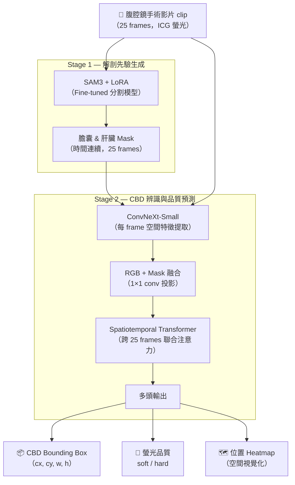

# iBSAFE CBD v1 — 術中總膽管辨識 Pipeline

> **給外科醫師的操作手冊**：本文件說明如何在 HPC 叢集上，從訓練到推論，獨立跑完整個兩階段 AI pipeline。無需理解程式碼，照著步驟執行即可。
>
> 想深入理解系統原理，請參閱 [`tutorial/`](tutorial/README.md) 的學習筆記系列。

---

## 一、專案簡介

**臨床目標**：在腹腔鏡膽囊切除術（cholecystectomy）過程中，自動辨識總膽管（Common Bile Duct, CBD）的位置與 ICG 螢光可見度，輔助外科醫師建立 Critical View of Safety（CVS），降低 bile duct injury 的風險。

**系統角色**：AI 作為「術中第二雙眼睛」，在外科醫師夾閉膽囊管前，即時標示出 CBD 的位置框與螢光品質（清晰 soft / 不清晰 hard），供臨床決策參考。

| 輸入 | 輸出 |
|---|---|
| 腹腔鏡手術影片 clip（5 秒，25 frames，ICG 螢光影像）| CBD bounding box（位置框）|
| | 螢光品質分類：`soft`（well-visualized）/ `hard`（poorly-visualized）|
| | 視覺化 overlay PNG + 預測 JSON |

---

## 二、系統架構：兩階段 Pipeline



**Stage 1** 的任務是「找出解剖邊界」：SAM3 是 Meta 的大型開放詞彙分割模型，透過 LoRA（Low-Rank Adaptation）微調使其適應 ICG 螢光影像，辨識膽囊與肝臟輪廓，作為 Stage 2 的空間先驗。

**Stage 2** 的任務是「定位 CBD」：ConvNeXt 提取每張 frame 的視覺特徵，與 Stage 1 的 mask 融合後，由 Spatiotemporal Transformer 整合 25 frames 的時序資訊，預測 CBD 的位置框與螢光品質。

---

## 三、目錄結構

```
iBSAFE_CBD_v1/
├── configs/              ← YAML 設定檔（訓練參數、資料路徑）
├── train/                ← 訓練入口腳本
├── infer/                ← 推論腳本（單張 / 影片 / 完整 pipeline）
├── slurm/                ← HPC job 提交排程腳本
├── src/                  ← 模型核心程式碼（勿直接修改）
│   ├── sam3/             ← Stage 1：SAM3 + LoRA 實作
│   └── cbd/              ← Stage 2：ConvNeXt + Transformer 實作
├── data_utils/           ← 資料前處理工具
├── tutorial/             ← 外科醫師視角學習筆記
├── runs/                 ← 訓練產物（自動建立，不要手動修改）
└── compute_cbd_prediction_metrics.py  ← Stage 2 指標計算
```

主要設定檔：

| 設定檔 | 用途 |
|---|---|
| `configs/icglceaes_lora.yaml` | Stage 1 訓練設定（ICG-LC-EAES 資料集）|
| `configs/bsafe_cbd.yaml` | Stage 2 訓練設定（B-SAFE 資料集）|

---

## 四、HPC 操作完整流程

> 所有步驟皆在 **HPC 上**執行（除非特別標注「本機」）。

### 前置作業（只做一次）

**1. SSH 進 HPC**

```bash
ssh <你的帳號>@<HPC 登入節點>
# 例如：ssh username@hpc-login.strasbourg.fr
```

**2. 進到 repo 目錄**

```bash
cd /home2020/home/<你的帳號>/<repo 所在路徑>/iBSAFE_CBD_v1
```

確認自己在正確的目錄（應看到 `configs/`、`slurm/`、`train/` 等資料夾）：

```bash
ls
```

**3. 確認 conda 環境**

```bash
# 確認工程師建好的環境存在
mamba env list | grep py311cu118
```

若看到 `py311cu118`，代表環境已就緒。之後的 training job 會自動啟用它（不需手動 activate）。

---

### 步驟一：確認 Stage 1 設定檔

打開 Stage 1 設定檔，確認資料路徑正確：

```bash
cat configs/icglceaes_lora.yaml
```

最關鍵的三個欄位：

| 欄位 | 預設值 | 說明 | 需要修改？ |
|---|---|---|---|
| `data.dataset_root` | `/home2020/home/miv/vedrenne/data/camma` | ICG-LC-EAES 資料集根目錄 | 若你有自己的資料夾才需改 |
| `training.num_epochs` | `15` | 訓練幾個 epoch | 通常不需改（除非要縮短測試）|
| `lora.rank` | `16` | LoRA 低秩維度，影響模型容量 | 通常不需改 |

> 若資料路徑有問題，聯繫工程師確認 HPC 上的掛載路徑。

---

### 步驟二：提交 Stage 1 訓練 job

```bash
python slurm/schedule_train.py \
    --config configs/icglceaes_lora.yaml \
    --experiment ibsafe_lora_v1 \
    --num-runs 1
```

**預期輸出**（成功）：
```
:: Scheduling runs with SLURM
Submitted batch job 12345678
```

系統會自動建立：
```
runs/ibsafe_lora_v1/{今天日期-時間}/run_1/
├── icglceaes_lora.yaml    ← 本次訓練的設定副本
└── train_run_1.job        ← 已提交的 Slurm 腳本
```

---

### 步驟三：監控 Stage 1 訓練進度

**查看 job 狀態**（R = Running，PD = 排隊中）：

```bash
squeue -u $USER
```

**即時看訓練 log**（替換 `{timestamp}` 為實際的日期時間字串）：

```bash
tail -f runs/ibsafe_lora_v1/{timestamp}/run_1/train_run_1.out
```

訓練正常運行時，log 會持續滾動，顯示類似：
```
Epoch 1/15: 100%|███| 120/120 [10:23<00:00, loss=4.2, lr=5.00e-05]
Epoch 1: train_loss=4.2, val_loss=4.1
```

**訓練完成訊號**（出現此行即完成）：
```
Finished training after XXXX optimizer steps
Best validation loss: X.XXXX
```

**中止 job**（若需要停止）：
```bash
scancel 12345678   # 替換為你的 job ID
```

> Stage 1 訓練時間約 **1-3 小時**（取決於 GPU 型號與排隊時間）。

---

### 步驟四：確認 Stage 1 訓練產物

訓練完成後，確認產物存在：

```bash
ls runs/ibsafe_lora_v1/{timestamp}/run_1/
```

**應看到**：
```
icglceaes_lora.yaml       ← 設定副本（Stage 2 會引用）
train_run_1.job           ← Slurm 腳本
train_run_1.out           ← 完整訓練 log
best_lora_weights.pt      ← 最佳 LoRA 權重（Stage 2 必需）
last_lora_weights.pt      ← 最後一個 epoch 的權重
val_stats.jsonl           ← train/val loss 曲線資料
checkpoint-100/           ← 中間 checkpoint
checkpoint-200/
...
```

**最重要的產物**：`best_lora_weights.pt`（約 10-50 MB）。

---

### 步驟五：確認 Stage 2 設定檔並提交訓練

**5.1 修改 Stage 2 設定檔，指向 Stage 1 的產物**

打開 `configs/bsafe_cbd.yaml`，找到 `stage1_sam3` 區塊：

```yaml
stage1_sam3:
  config_path: /home2020/.../runs/ibsafe_lora/2026-03-24-15-38/run_1/icglceaes_lora.yaml
  weights_path: /home2020/.../runs/ibsafe_lora/2026-03-24-15-38/run_1/best_lora_weights.pt
```

把這兩個路徑改為你在步驟四產出的實際路徑：

```yaml
stage1_sam3:
  config_path: /home2020/home/<你的帳號>/<repo>/iBSAFE_CBD_v1/runs/ibsafe_lora_v1/{timestamp}/run_1/icglceaes_lora.yaml
  weights_path: /home2020/home/<你的帳號>/<repo>/iBSAFE_CBD_v1/runs/ibsafe_lora_v1/{timestamp}/run_1/best_lora_weights.pt
```

**5.2 確認 Stage 2 資料路徑**

同樣在 `bsafe_cbd.yaml`，確認 B-SAFE 資料集路徑正確：

```yaml
data:
  datasets:
    bsafe:
      dataset_root: /home2020/home/icube/camma_files/camma_data/bsafe_dataset/bsafe
      clips_root: /home2020/.../bsafe/cbd_v2/clips
      easy_mask_cache_root: /home2020/.../bsafe/cbd_v2/easy_masks
```

**5.3 提交 Stage 2 訓練 job**

```bash
python slurm/schedule_cbd_train.py \
    --config configs/bsafe_cbd.yaml \
    --experiment bsafe_cbd_v1 \
    --num-runs 1
```

監控方式同步驟三，換成 Stage 2 的 log 路徑：
```bash
tail -f runs/bsafe_cbd_v1/{timestamp}/run_1/train_cbd_run_1.out
```

訓練完成後，產物在：
```
runs/bsafe_cbd_v1/{timestamp}/run_1/
├── bsafe_cbd.yaml
├── best_cbd.pt          ← Stage 2 最佳模型（推論用）
└── val_stats.jsonl
```

> Stage 2 訓練時間約 **2-5 小時**。

---

### 步驟六：推論

根據需求選擇對應的腳本：

#### 6.1 單張影像快速測試（Stage 1 效果確認）

```bash
python infer/infer_lora.py \
    --config runs/ibsafe_lora_v1/{timestamp}/run_1/icglceaes_lora.yaml \
    --weights runs/ibsafe_lora_v1/{timestamp}/run_1/best_lora_weights.pt \
    --image /path/to/test_frame.png \
    --prompt gallbladder --prompt liver \
    --output ./output_overlay.png \
    --threshold 0.5
```

輸出：`output_overlay.png`（影像上標示膽囊與肝臟的 bounding box + mask）

#### 6.2 影片追蹤（產出 Stage 2 所需的 mask 序列）

```bash
python infer/infer_video_lora.py \
    --config runs/ibsafe_lora_v1/{timestamp}/run_1/icglceaes_lora.yaml \
    --weights runs/ibsafe_lora_v1/{timestamp}/run_1/best_lora_weights.pt \
    --video /path/to/clip.mp4 \
    --prompt gallbladder --prompt liver \
    --strategy adaptive \
    --stride 8 \
    --output ./output_video_dir/
```

輸出：`output_video_dir/` 內含每 frame 的 mask 追蹤結果

#### 6.3 完整兩階段 Pipeline 推論（最終 CBD 偵測）

```bash
python infer/infer_cbd_clip.py \
    --config runs/bsafe_cbd_v1/{timestamp}/run_1/bsafe_cbd.yaml \
    --weights runs/bsafe_cbd_v1/{timestamp}/run_1/best_cbd.pt \
    --clip /path/to/clip_directory/ \
    --output ./cbd_output_overlay.png
```

輸出：
- `cbd_output_overlay.png` — 視覺化結果（CBD 位置框 + 螢光品質標籤）
- `*_overlay.json` — 機器可讀的預測資料（bbox, 品質分類）

---

### 步驟七：評估指標

#### Stage 1 評估（膽囊 & 肝臟偵測品質）

```bash
python infer/eval_lora.py \
    --config runs/ibsafe_lora_v1/{timestamp}/run_1/icglceaes_lora.yaml \
    --weights runs/ibsafe_lora_v1/{timestamp}/run_1/best_lora_weights.pt \
    --split test \
    --output runs/ibsafe_lora_v1/{timestamp}/run_1/eval_test.json
```

看 `eval_test.json` 裡的關鍵指標：

| 指標 | 意義 | 合理起步值 |
|---|---|---|
| `mAP50` | IoU ≥ 0.50 下的平均精度 | ≥ 0.5 |
| `mAP` | IoU 0.50-0.95 的平均精度 | ≥ 0.3 |
| `per_class_AP` | 各類別（膽囊/肝臟）的個別精度 | — |

#### Stage 2 評估（CBD 偵測與品質分類）

先對整個測試集跑推論，將結果存在一個資料夾，再計算指標：

```bash
python compute_cbd_prediction_metrics.py \
    /path/to/inference/outputs/ \
    --json-output metrics_stage2.json
```

關鍵指標：

| 指標 | 意義 |
|---|---|
| `mean_iou` | 預測框與 GT 框的平均 IoU |
| `mAP50` | IoU ≥ 0.50 下的 CBD 偵測精度 |
| `accuracy` | 螢光品質分類正確率（soft/hard）|
| `macro_f1` | 兩類平均 F1 score |

---

## 五、設定檔關鍵參數速查

### Stage 1：`configs/icglceaes_lora.yaml`

| 區塊 | 參數 | 預設值 | 說明 |
|---|---|---|---|
| `data` | `dataset_root` | `/home2020/.../camma` | 資料集根目錄，**路徑必須正確** |
| `data` | `class_names` | `[gallbladder, liver]` | 偵測目標，通常不改 |
| `lora` | `rank` | `16` | LoRA 維度；增大 → 容量更高但需更多記憶體 |
| `training` | `num_epochs` | `15` | 訓練回合數；縮短可用於快速測試 |
| `training` | `learning_rate` | `5.0e-5` | 學習率；通常不需改 |
| `training` | `batch_size` | `2` | 每次 GPU 處理的影像數；受 VRAM 限制 |
| `output` | `output_dir` | `outputs/icglceaes_lora` | 預設輸出路徑（schedule 腳本會自動覆蓋）|

### Stage 2：`configs/bsafe_cbd.yaml`

| 區塊 | 參數 | 預設值 | 說明 |
|---|---|---|---|
| `stage1_sam3` | `config_path` | 工程師路徑 | **必須改為 Stage 1 的 run 路徑** |
| `stage1_sam3` | `weights_path` | 工程師路徑 | **必須改為 `best_lora_weights.pt` 路徑** |
| `data.datasets.bsafe` | `dataset_root` | `/home2020/.../bsafe` | B-SAFE 資料集路徑 |
| `model` | `variant` | `v2_spatiotemporal` | 模型版本；通常不改 |
| `training` | `num_epochs` | `30` | 訓練回合數 |
| `training` | `learning_rate` | `1.0e-4` | 新層學習率 |
| `training` | `backbone_lr` | `1.0e-5` | ConvNeXt 骨幹學習率（慢 10 倍，保留 ImageNet 特徵）|

---

## 六、常見問題與除錯

**Q1：job 提交後一直在排隊（PD），怎麼辦？**

A：HPC 排隊是正常的，GPU 資源有限。用 `squeue -u $USER` 查看狀態。若排隊超過數小時，可以聯繫管理員確認叢集狀況。也可以嘗試加上 `--gpu a40 v100` 請求較不熱門的 GPU 型號（速度較慢但等待較短）。

---

**Q2：訓練 log 出現 `LoRA checkpoint config does not match`？**

A：`--config` 與 `--weights` 必須來自**同一次訓練的 run 目錄**。正確做法：
```bash
# ✅ 用 run 目錄裡的 config 副本（非原始 configs/）
--config runs/ibsafe_lora_v1/{timestamp}/run_1/icglceaes_lora.yaml
--weights runs/ibsafe_lora_v1/{timestamp}/run_1/best_lora_weights.pt
```

---

**Q3：推論結果完全空（`total: 0`）？**

A：依序檢查：
1. Prompt 是否拼錯（必須和訓練時 `class_names` 完全一致，例如 `gallbladder` 全小寫）
2. 嘗試降低 threshold：加上 `--threshold 0.1`
3. 確認 `--weights` 是 `best_lora_weights.pt`（不是 `last_lora_weights.pt`）
4. 確認影像是否在訓練資料的分布範圍內（如：是否為 ICG 螢光影像）

---

**Q4：HPC 無法下載 HuggingFace 上的 SAM3 模型（約 5 GB）？**

A：先在本機下載，再傳到 HPC：
```bash
# 本機執行：下載 SAM3 權重
python -c "from huggingface_hub import snapshot_download; snapshot_download('facebook/sam3')"

# 傳到 HPC
scp -r ~/.cache/huggingface/hub/models--facebook--sam3 \
    <username>@<hpc>:/home2020/home/<username>/.cache/huggingface/hub/
```
之後在 `configs/icglceaes_lora.yaml` 設定 `model.load_from_hf: true` 即可自動找到快取。

---

**Q5：如何把訓練結果從 HPC 拷到本機？**

```bash
# 拷貝 LoRA 權重
scp <username>@<hpc>:/home2020/.../runs/ibsafe_lora_v1/{timestamp}/run_1/best_lora_weights.pt \
    /本機路徑/best_lora_weights.pt

# 若檔案很大，用 rsync（支援續傳）
rsync -avzP <username>@<hpc>:/home2020/.../runs/ibsafe_lora_v1/{timestamp}/run_1/ \
    /本機路徑/run_1/
```

---

**Q6：如何查看 train/val loss 曲線？**

把 `val_stats.jsonl` 拷到本機，在 Jupyter Notebook 或 Python 中畫圖：
```python
import pandas as pd
import matplotlib.pyplot as plt

df = pd.read_json("val_stats.jsonl", lines=True)
df.plot(x="global_step", y=["train_loss", "val_loss"])
plt.title("Stage 1 Training Curve")
plt.show()
```

如果 `train_loss` 持續下降但 `val_loss` 反彈 → 過擬合（overfitting），可考慮減少 `num_epochs` 或增加 `dropout`。

---

**Q7：Stage 2 推論時，`easy_mask_cache_root` 找不到 mask 快取？**

Stage 2 需要 Stage 1 預先產出的 mask 快取（`.npz` 格式）。若快取不存在，需要先執行：
```bash
python slurm/schedule_prepare_cbd_easy_masks.py \
    --config configs/bsafe_cbd.yaml
```
這個步驟會用 Stage 1 的 LoRA 對所有 B-SAFE 影片跑推論並快取結果（通常需要數小時）。

---

## 七、學習資源導覽

`tutorial/` 目錄包含以外科醫師視角撰寫的完整學習筆記，適合想深入理解系統原理的讀者。

### Stage 1 系列（已完整）

| 章節 | 主題 |
|---|---|
| [01 SAM3 + LoRA 總覽](tutorial/stage1_SAM3+LoRA_Fine-tuning/01_sam3_lora_overview.md) | Pipeline 全景、工程師原文拆解、SAM3 鳥瞰圖 |
| [02 SAM3 架構深解](tutorial/stage1_SAM3+LoRA_Fine-tuning/02_sam3_architecture_deep.md) | 五大組件（Vision/Text/Geometry/Encoder/Decoder）+ forward pass |
| [02 補充筆記](tutorial/stage1_SAM3+LoRA_Fine-tuning/02_Notes_sam3_architecture_deep.md) | ICG 流向、Stage 1/2 分工邏輯 |
| [03 LoRA 原理與凍結策略](tutorial/stage1_SAM3+LoRA_Fine-tuning/03_lora_principles_and_freeze.md) | 低秩分解數學、三層自寫類別、凍結設計 |
| [04 資料管線](tutorial/stage1_SAM3+LoRA_Fine-tuning/04_data_pipeline_class_prompted_box.md) | COCO JSON → BatchedDatapoint、Augmentation、Prompt 對應 |
| [05 訓練主迴圈 + Slurm](tutorial/stage1_SAM3+LoRA_Fine-tuning/05_training_loop_and_slurm.md) | Trainer 拆解、Loss 組合、HPC 提交流程 |
| [06 推論 + 評估 + 實操](tutorial/stage1_SAM3+LoRA_Fine-tuning/06_inference_eval_handson_recipe.md) | **三種推論模式 + 從零跑通 4 階段完整腳本** |
| [06 補充筆記](tutorial/stage1_SAM3+LoRA_Fine-tuning/06_Notes_inference_eval_handson_recipe.md) | Fine-tuned SAM3 輸入/輸出解析 |

### Stage 2 系列（ConvNeXt 教學完成，Transformer 部分撰寫中）

| 章節 | 主題 | 狀態 |
|---|---|---|
| [01 ConvNeXt 架構基本](tutorial/stage2_ConvNeXt_Spatiotemporal/01_convnext_architecture_basics.md) | 4 個 stage 金字塔結構、為何選 Small | ✅ |
| [02 在 CBD v2 的角色](tutorial/stage2_ConvNeXt_Spatiotemporal/02_convnext_role_in_cbdv2.md) | 輸入輸出形狀、v1 vs v2 比較 | ✅ |
| [03 凍結策略與差別學習率](tutorial/stage2_ConvNeXt_Spatiotemporal/03_convnext_freeze_strategies.md) | 三種凍結模式、10× backbone 學習率 | ✅ |
| [04 RGB + mask 融合](tutorial/stage2_ConvNeXt_Spatiotemporal/04_rgb_mask_fusion.md) | Stage 1 mask 融合機制、1×1 conv | ✅ |
| [05 銜接 Temporal Transformer](tutorial/stage2_ConvNeXt_Spatiotemporal/05_handoff_to_temporal_transformer.md) | CLS token、Box query、五個輸出 head | ✅ |
| Spatiotemporal Transformer 內部 | joint attention、跨 frame 時序建模 | 撰寫中 |
| 訓練主迴圈與 multi-task loss | box_l1 / giou / center_ce / heatmap / type_ce | 待撰 |
| 推論流程與評估指標 | `compute_cbd_prediction_metrics.py` 深解 | 待撰 |

---

## 八、Git Remote 設定

```bash
git remote -v
# 應看到：
# origin    git@github.com:dreamhunteryin/iBSAFE_CBD_v1.git   (你的 GitHub，push 目的地)
# upstream  git@forge.icube.unistra.fr:CAMMA/code/bsafe/cbd_v1.git   (工程師官方 repo)

# 從工程師拉最新更新（只 fetch，不 push）
git fetch upstream
git merge upstream/main
```

> **注意**：只對 `origin`（你的 GitHub）使用 `git push`，**不要** push 到 `upstream`（工程師的 CAMMA repo）。

---

*最後更新：2026-05-07*
