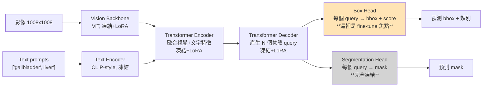

# 01 — SAM3 + LoRA Fine-tuning:Pipeline 第一塊總覽

> 這是 6 份系列筆記的第 1 份。後續:架構深解 → LoRA 原理 → 資料管線 → 訓練流程 → 實操推論。

---

## 臨床視角開場

把整個 CBD 預測 pipeline 想成「術中三級警示系統」:

| 級別 | 對應到 pipeline | 對應到外科 |
|---|---|---|
| **第 1 級:看見器官** | SAM3+LoRA(本份筆記主題) | 從鏡頭畫面**先框出膽囊與肝臟在哪** |
| **第 2 級:時間連續性** | ConvNeXt + 雙向 Transformer | 5 秒影像匯總,看膽囊區域**動態變化** |
| **第 3 級:CBD 風險判讀** | 分類頭 + bbox query | 預測 CBD 螢光顯影**好/不好** + 框出 CBD 位置 |

第 1 級的工作 = **產生 anatomical priors(解剖先驗)**。模型不直接告訴你 CBD 在哪,而是先告訴下游模組:「肝臟在這、膽囊在那」,讓下游帶著這個解剖地圖去判讀 CBD。

→ 類比:就像 MRCP 影像由放射科技術員先做出**多平面重建**,再由放射科醫師**基於重建後的解剖標記**判讀;沒有重建就直接看 raw data 很費力,有了重建判讀就快又準。

---

## 工程師原文逐句拆解

工程師交付給你的描述(共 7 句)。逐句翻譯為**這在 codebase 哪裡實作**:

> ① The proposed pipeline first **adapted a SAM3 model**[^sam3] to the ICG surgical domain using **LoRA fine-tuning** with **class-prompted bounding box supervision** from a separate labeled ICG dataset.

- **adapted SAM3**:用 Meta 預訓練的通用分割模型 SAM3 (`facebook/sam3` HuggingFace checkpoint) 當起點 → `cbd_v1/src/sam3/model_builder.py:495-537`
- **LoRA fine-tuning**:不重訓所有參數,只在某些線性層旁邊加「低秩補丁」並只訓那些補丁 → `cbd_v1/src/sam3/lora/lora_layers.py`
- **class-prompted**:輸入時除了影像,還餵一段文字 prompt(如 `"gallbladder"`、`"liver"`),模型根據 prompt 找對應器官
- **separate labeled ICG dataset**:用一份**跟 CBD 無關**的 ICG 標註資料(在 ICG 螢光下標出膽囊與肝臟邊界)→ `cbd_v1/configs/icglceaes_lora.yaml`

> ② **Only the box detection component** of SAM3 was fine-tuned, **whereas the box-to-mask head was kept unchanged** as an object-agnostic mask decoder.

- 這是整個 stage 1 的設計核心:LoRA **只注入** transformer encoder/decoder(負責產生 box),**不注入** segmentation head(負責產生 mask)→ `cbd_v1/configs/icglceaes_lora.yaml:39` (`apply_to_mask_decoder: false`)
- "object-agnostic mask decoder" = **mask decoder 不認識特定物體**,它只負責「給我一個 box,我幫你切出 box 內最像物體的形狀」。所以 box 變了 mask 自然跟著變,即使 mask decoder 權重沒動

> ③ The fine-tuned model generated **temporally consistent** liver and gallbladder masks, which were used as **anatomical priors rather than direct CBD labels**.

- **temporally consistent**:在連續 25 frames 上 mask 不會閃跳。透過 SAM3 內建的 video tracking 機制做到 → `cbd_v1/infer/infer_video_lora.py`、`PromptedVideoTracker`
- **priors not labels**:這些 mask **不是模型最終輸出**,而是當下游模型的「輸入線索」(後面 ConvNeXt + transformer 會把 mask 跟 RGB 一起當特徵)

> ④ For each target frame, **a 5-second video clip preceding the annotated frame** was sampled at 5 frames per second, **yielding 25 RGB frames** and corresponding SAM3-derived masks.

- 這已經是 stage 2(後續筆記範圍),但 stage 1 必須能在這 25 frames **每一張** 都產出 mask
- 對應 config:`cbd_v1/configs/bsafe_cbd.yaml:1-9`(`clip_fps: 5`、`clip_len: 25`)

> ⑤ ⑥ ⑦(關於 ConvNeXt、spatiotemporal、bbox regression) — **不在本份筆記範圍**,屬於 pipeline 第 2-3 塊,留給後續筆記。

[^sam3]: SAM3 = Segment Anything Model v3,Meta 2025 年發表的開放詞彙(open-vocabulary)分割模型,可用文字 prompt 指定要切哪個物體。前代 SAM/SAM2 只接受點/框 prompt,SAM3 才支援自然語言。

---

## SAM3 鳥瞰圖:資料如何在模型裡流動



**讀圖重點**:
- 黃色框 = 受 LoRA 微調影響(訓練時調整)
- 灰色框 = 完全凍結(訓練時不動)
- LoRA 的「補丁」其實是貼在 **Vision Backbone / Encoder / Decoder 內部的線性層**,不是另外加一個方塊。圖示為了清楚才簡化

---

## 為什麼這個設計很聰明:三個關鍵決策

### 決策 1:用 LoRA 而不是全參數微調

SAM3 約有 **10 億+** 參數。在 ICG 資料集(ICG-LC-EAES)上做 full fine-tune 的問題:
- **VRAM 爆炸**:存 optimizer state(AdamW 對每個參數要存 momentum + variance,等於把參數量 ×3)
- **過擬合風險**:ICG dataset 規模有限(估計幾百到幾千張),全參數會背下訓練集細節,失去 SAM3 的通用分割能力(catastrophic forgetting)
- **儲存成本**:每個 fine-tune 版本要存完整 checkpoint(GB 級別)

LoRA 解法:rank=16、alpha=32,實際可訓練參數**只佔總參數的 0.1-0.5%**。VRAM、過擬合、儲存全部解決。

→ 細節留給 **03_lora_principles_and_freeze.md**

### 決策 2:只 fine-tune box detection,凍結 mask decoder

工程師明說:「box-to-mask head 保持不動」。為什麼?

- **SAM3 的 mask decoder 已經是泛用神器**:給它任何 box,它都能產出該 box 內的精細 mask。Meta 在數十億張影像上預訓練過,輪廓品質遠高於我們在 ICG 上能訓練出來的版本
- **真正需要學的是「找對 box」**:在 ICG 螢光影像(綠色為主、對比度低、與一般彩色內視鏡很不同)裡,SAM3 預設的 box 不準。所以**只調整「box 怎麼找」**,**不動「mask 怎麼從 box 切出來」**
- 這個策略對應到 config:
  ```yaml
  # icglceaes_lora.yaml:33-39
  apply_to_vision_encoder: true     # 視覺 backbone 適配新影像風格
  apply_to_text_encoder: false      # 文字編碼用通用語意,無需調整
  apply_to_detr_encoder: true       # encoder 融合視覺+文字
  apply_to_detr_decoder: true       # decoder 產 box query
  apply_to_mask_decoder: false      # ← 凍結
  ```

### 決策 3:用 ICG-LC-EAES(僅 bbox)而非 EndoScapes(有 mask)

兩個 dataset 對比:

| | EndoScapes-Seg201-CBD | ICG-LC-EAES |
|---|---|---|
| 類別數 | 6 類(膽囊、膽囊管、膽囊動脈、Calot 三角、囊區板、工具) | **2 類**(膽囊、肝臟) |
| 標註類型 | bbox + segmentation mask | **僅 bbox**,無 mask |
| bbox anchor | topleft (COCO 標準) | center |
| 影像光譜 | 常規白光腹腔鏡 | **ICG 螢光成像** |
| 對應 config | `endoscapes_lora.yaml` | **`icglceaes_lora.yaml`(stage 1 真正使用)** |
| `use_mask_loss` | true(訓練 mask + box) | **false(只訓 box)** |

關鍵點:**stage 1 的目標是讓 SAM3 在 ICG 螢光下找對 box**,所以選 ICG dataset 才有意義。EndoScapes 是常規白光,光譜不同,訓出來的 LoRA 適配不到 ICG 影像。

→ 兩個 dataset 細節留給 **04_data_pipeline_class_prompted_box.md**

---

## 「在 codebase 哪裡」速查表(本份筆記層級)

| 議題 | 檔案 | 行號 |
|---|---|---|
| **真正用於 stage 1 的 LoRA 配置** | `configs/icglceaes_lora.yaml` | 全 77 行 |
| **訓練腳本入口** | `train/train_lora.py` | `main()` @ 第 644-645 行 |
| **建模 + 套 LoRA 兩步驟** | `train/train_lora.py` | 第 172-184 行 |
| **SAM3 模型構建** | `src/sam3/model_builder.py` | `build_sam3_image_model()` @ 第 495-537 行 |
| **LoRA 主類別** | `src/sam3/lora/lora_layers.py` | `LoRALayer` @ 第 176-218 行 |
| **LoRA 注入流程** | `src/sam3/lora/lora_layers.py` | `apply_lora_to_model()` @ 第 374-522 行 |
| **下游 pipeline 的 stage1 引用** | `configs/bsafe_cbd.yaml` | 第 29-42 行(`stage1_sam3` 段落) |

---

## 常見疑問(外科醫師視角 FAQ)

### Q1:既然 SAM3 已經很強,為什麼還要 fine-tune?

A:SAM3 預訓練資料**沒看過 ICG 螢光影像**。ICG 螢光看起來幾乎全綠色、組織邊界靠螢光強度差異而非紋理。直接拿 SAM3 跑 ICG 影片,它會很困惑(就像放射科醫師第一次看 PET 影像會不適應)。LoRA fine-tune 等於給 SAM3 上一堂「ICG 影像速成課」。

### Q2:為什麼工程師選 SAM3 而不是 nnU-Net、Mask2Former 之類傳統分割模型?

A:三個原因——
1. **文字 prompt 機制**:同一個模型可以切「膽囊」也可以切「肝臟」,不需要為每個器官訓一個專屬模型
2. **video tracking 內建**:SAM3 對連續 frame 有專門的 tracker,直接給「連續 25 frames 一致的 mask」這個需求買單(`infer_video_lora.py` 用這個)
3. **mask decoder 是現成神器**:不用從零訓 segmentation head

### Q3:fine-tune 完之後,模型怎麼跨醫院 / 跨設備泛化?

A:這正是工程師選 ICG-LC-EAES dataset 的策略——它本身就來自不同醫院的協作標註(`gallbladder + liver` 兩類、`bbox_anchor: center`)。LoRA 的「低秩」性質讓它**只學 ICG 通用特徵,不會 overfit 單一醫院**(這是 LoRA 相對 full fine-tune 的隱含優點)。

### Q4:如果我想把模型用在膽囊以外的器官(例如胰臟、十二指腸),要重新訓嗎?

A:**不一定**——只要那個器官在 ICG 螢光下也能看見,你只需要在推論時把 prompt 從 `"gallbladder"` 改成 `"pancreas"`,模型可能就直接給你 box(雖然品質未知)。**這就是文字 prompt 模型的魔力**。但若效果差,需要用該器官的標註資料再做一次 LoRA fine-tune(代價低,因為 LoRA 訓練快、checkpoint 小)。

### Q5:訓練要跑多久?

A:`icglceaes_lora.yaml` 預設 `num_epochs: 15`、batch size 2/GPU、gradient accumulation 8 → 等效 batch size 16。在 2 張 H100 上估計**幾小時到一天**(取決於 dataset 大小)。實際 wall time 在第 5 份筆記會詳細估算。

---

## 本份筆記想讓你帶走的 5 件事

1. ✅ **SAM3+LoRA 在 pipeline 中的角色 = 產 anatomical priors,不是直接判讀 CBD**
2. ✅ **LoRA = 只訓「補丁」,基礎模型參數凍結;省 VRAM、省儲存、防過擬合**
3. ✅ **「只訓 box,凍結 mask」是 SAM3 fine-tune 的標準操作**(相當於只調定位、不調分割)
4. ✅ **真正用的 config 是 `icglceaes_lora.yaml`(2 類:gallbladder + liver)**,不是 `endoscapes_lora.yaml`
5. ✅ **fine-tune 後產出的是 LoRA 權重檔(`best_lora_weights.pt`)**,被 pipeline stage 2 (`bsafe_cbd.yaml`) 引用為解剖先驗來源

---

## 下一步

如果讀完還對 SAM3 內部「視覺+文字怎麼融合」有疑問,進入 **[02_sam3_architecture_deep.md](02_sam3_architecture_deep.md)** — 那份會把上面鳥瞰圖的每個方塊拆開,告訴你 ViT、CLIP-style text encoder、Transformer encoder/decoder 各自的職責與 forward pass 細節。

如果你已經滿足於「SAM3 是個黑盒子,我知道它接受影像+文字 prompt,輸出 box+mask 就好」,可以直接跳到 **[03_lora_principles_and_freeze.md](03_lora_principles_and_freeze.md)** — 那份才是最實作核心的(LoRA 數學 + 凍結策略 + 程式碼)。
