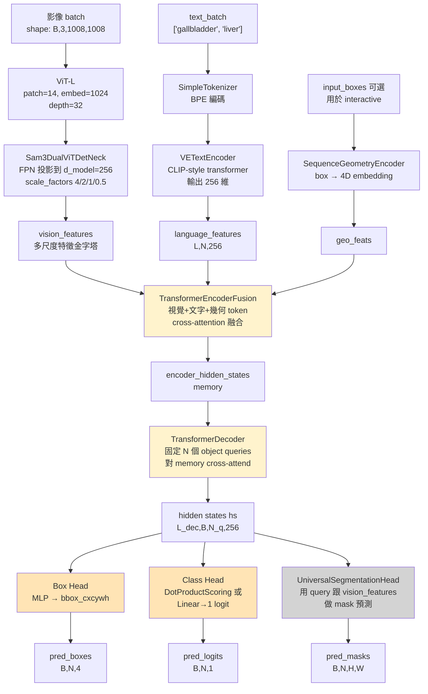

# 02 — SAM3 架構深解:五大組件與一次 forward pass

> 系列第 2 份。前置:[01 總覽](01_sam3_lora_overview.md)。
> 後續:[03 LoRA 原理與凍結策略](03_lora_principles_and_freeze.md)。

---

## 為什麼要懂內部?

01 把 SAM3 當鳥瞰圖看。但 LoRA 注入時你必須回答這類問題:
- 「`apply_to_vision_encoder: true` 到底改了哪些層?」
- 「為什麼 text encoder 在 ICG config 裡設成 `false`,推論時 `'gallbladder'` 還能被理解?」
- 「forward 時影像跟文字到底在哪一步『相遇』的?」

讀完這份你會有具體答案,後續看訓練 log、debug 才不會卡住。

---

## 五大組件一覽

| # | 組件 | 角色 | 主要檔案 | 在 LoRA config 對應的旗標 |
|---|---|---|---|---|
| 1 | **Vision Backbone (ViT)** | 把 1008×1008 影像切 patch、抽視覺特徵 | `src/sam3/model/vitdet.py`<br/>+ `model/necks.py` | `apply_to_vision_encoder` |
| 2 | **Text Encoder (CLIP-style)** | 把 `"gallbladder"` 字串編成 256 維語意向量 | `src/sam3/model/text_encoder_ve.py` | `apply_to_text_encoder` |
| 3 | **Geometry Encoder** | 把 input box(像 bbox prompt 那種)編碼為 token | `src/sam3/model/geometry_encoders.py` | `apply_to_geometry_encoder` |
| 4 | **Transformer Encoder + Decoder** | 視覺/文字/幾何 token 互相 attend,產出 N 個物體 query | `src/sam3/model/encoder.py`<br/>`src/sam3/model/decoder.py` | `apply_to_detr_encoder`<br/>`apply_to_detr_decoder` |
| 5 | **Universal Segmentation Head** | 拿 query + 影像特徵 → 輸出 mask | `src/sam3/model/maskformer_segmentation.py` | `apply_to_mask_decoder` |

組裝流程都在 `src/sam3/model_builder.py:495-537`(`build_sam3_image_model()`),第 510-521 行可看到組件依序被 instantiate。

---

## Forward pass mermaid 圖(一次推論的完整流程)



**讀圖說明**:
- 三條輸入線(影像 / 文字 / 幾何)在 `TransformerEncoderFusion` 才匯流
- 黃色 = 在 LoRA stage 1 被微調(視覺 encoder + DETR encoder/decoder + box/class head)
- 灰色 = **完全凍結**(segmentation head)
- 程式入口:`Sam3Image.forward()` @ `src/sam3/model/sam3_image.py:501-547`,你跟著這個函式讀就能對到圖上每個方塊

---

## 組件 1:Vision Backbone — ViT-L

### 規格(`model_builder.py:57-83` 的 `_create_vit_backbone()`)

| 參數 | 值 | 意義 |
|---|---|---|
| `img_size` | 1008 | 輸入影像邊長(會 resize)|
| `patch_size` | 14 | 每個 patch 是 14×14 像素 → 1008/14 = 72 → 72×72 = **5184 個 patch** |
| `embed_dim` | 1024 | 每個 patch 編成 1024 維向量 |
| `depth` | 32 | 32 層 transformer |
| `num_heads` | 16 | multi-head attention 16 個頭 |
| `mlp_ratio` | 4.625 | FFN 隱藏層 = 1024 × 4.625 ≈ 4736 |
| `use_rope` | True | 用 RoPE(rotary positional embedding)而非 absolute |
| `global_att_blocks` | (7, 15, 23, 31) | **只有第 7、15、23、31 層做全局 attention**,其餘是 windowed(節省計算)|
| `window_size` | 24 | windowed attention 的 window 大小 |

→ 這是 **Vision Transformer Large (ViT-L)** 的標準規格,但用了 RoPE + windowed attention 兩個現代化改造,專為高解析度設計。

### 接在 ViT 後面的 Neck(`Sam3DualViTDetNeck`)

`model_builder.py:86-97`(`_create_vit_neck()`):
- ViT 輸出單一尺度特徵(72×72×1024)
- Neck 把它**上採樣 + 下採樣**為 4 個尺度(scale_factors=[4.0, 2.0, 1.0, 0.5])
- 並把 1024 維壓到統一的 `d_model=256` 給 transformer 用
- 輸出多尺度特徵金字塔(FPN-like)

### LoRA 注入點

當 `apply_to_vision_encoder: true`,LoRA 會被注入 ViT 內所有滿足 target_modules 的線性層:
- `qkv`(Q/K/V 融合 projection)
- `proj`(attention output projection)
- `fc1` / `fc2`(每層 FFN 的兩個線性)

「為什麼這層需要 LoRA?」→ ICG 螢光影像的視覺特徵分布跟一般彩色影像差異大(綠色為主、低對比),attention pattern 需要重新校準。

---

## 組件 2:Text Encoder — CLIP-style

### 在哪裡

- `model_builder.py:120` 附近(`_create_text_encoder()`),內部用 `VETextEncoder`(`src/sam3/model/text_encoder_ve.py`)
- Tokenizer 用 BPE(`src/sam3/model/tokenizer_ve.py`),vocab 檔案在 `src/sam3/assets/bpe_simple_vocab_16e6.txt.gz`

### 它做什麼

```
input:  ["gallbladder", "liver"]
        ↓ BPE tokenize
        [[1234, 567, 890], [2345]]
        ↓ embedding lookup + positional + transformer layers
output: language_features (token-wise, L,N,256)
        language_mask     (padding mask)
        text_embeds       (sentence-level pooled)
```

關鍵點:**輸出的 256 維跟 vision/transformer 的 d_model=256 對齊**,這樣它們才能在後續 cross-attention 裡直接互動。

### 為什麼 stage 1 把這個 freeze 掉(`apply_to_text_encoder: false`)

`"gallbladder"` 這個詞的語意,SAM3 預訓練已經學得很好。微調 ICG 影像不應該動到語意理解(否則可能反而傷害模型對 prompt 的辨識)。所以**只訓練「視覺端如何回應這個語意」,不訓練「語意端怎麼編碼這個詞」**。

→ 這也解釋了 01 FAQ 第 4 題:推論時直接換 `"pancreas"` 是可行的——因為 text encoder 沒被改動,新詞只要在原 vocab 裡都能被合理編碼。

---

## 組件 3:Geometry Encoder

### 角色

`SequenceGeometryEncoder`(`src/sam3/model/geometry_encoders.py`)。當有 **bounding box prompt** 輸入時(例如使用者畫了一個框,要 SAM3 切該框內的物體),這個 encoder 把 4 個座標數字編成跟 text/vision feature 維度一樣的 token。

### Prompt class(`geometry_encoders.py:82-249`)

```python
@dataclass
class Prompt:
    box_embeddings:  # (4, num_prompts, 1)  — 框座標
    box_labels:      # (num_prompts,)        — 1=正樣本, -1=負樣本
    box_mask:        # (num_prompts, 1)      — padding mask
```

### Stage 1 是否用?

**訓練時不用**(在 `train_lora.py` 餵入的是 GT bbox 作為 supervision target,不是 prompt input)。但**推論時可選**(`infer_lora.py` 預設沒用 box prompt,走純文字 prompt 模式)。

`apply_to_geometry_encoder: false`(ICG config 預設)→ 這部分完全凍結。

---

## 組件 4:Transformer Encoder + Decoder

### Encoder:`TransformerEncoderFusion`(`src/sam3/model/encoder.py`)

把三條輸入(視覺 token + 文字 token + 幾何 token)**串接成一個 sequence**,然後跑多層 self-attention + cross-attention,讓不同模態互相影響。
- 輸入:vision_features + language_features + geo_features
- 輸出:`encoder_hidden_states`(融合後的 memory)

關鍵參數:`d_model=256`、多層、有 RoPE 位置編碼。

對應到 `Sam3Image._run_encoder()` @ `sam3_image.py:212` 之後。

### Decoder:DETR-style 物體查詢

`src/sam3/model/decoder.py` 內的 `TransformerDecoder`。設計是 **DETR 風格的 object query**:
- 維持固定數量的 query 向量(例如 N=200)
- 每個 query 對 encoder memory 跑 cross-attention,**逐層精煉**自己的表徵
- 最後每個 query 都對應到「一個可能的物體」(bbox + class + mask)

關鍵設計:**O2O / O2M dual matcher**(`sam3_image.py:96-99`):
- O2O = One-to-One:每個 GT 配一個 query(經典 DETR 做法)
- O2M = One-to-Many:每個 GT 可配多個 query(加速收斂、提升召回)
- 訓練時兩種匹配同時用,推論時只取 O2O

對應到 `Sam3Image._run_decoder()`,接在 `_run_encoder` 之後。

### Box Head 與 Class Head

每個 decoder 層輸出的 hidden state(`hs`)會被兩個 head 處理:
- **Box Head**:幾層 MLP,輸出 4 個數字 → 規格化的 cxcywh 座標
- **Class Head**:當 `use_dot_prod_scoring=True`(SAM3 預設),用 `DotProductScoring` 把 query 跟 text feature 做 dot product 算「跟 prompt 多匹配」;否則用普通 `Linear → 1 logit`(`sam3_image.py:80-90`)

### 為什麼這部分要訓?

LoRA 的 ICG config 把 detr_encoder/decoder 都打開(`apply_to_detr_encoder: true`、`apply_to_detr_decoder: true`),因為:
- ICG 影像光譜不同 → encoder 融合策略需重新調整
- 物體位置分布跟一般 dataset 不同 → decoder 的 box query 表徵需重新校準

---

## 組件 5:Universal Segmentation Head(凍結對象)

### 在哪裡

`UniversalSegmentationHead`(`src/sam3/model/maskformer_segmentation.py`)。對應到 `Sam3Image._run_segmentation_heads()` @ `sam3_image.py:476-487`。

### 它怎麼產生 mask?

這是 SAM3 的精巧之處——**它不像 U-Net 是「影像 → 解碼器 → mask」**,而是:

```
拿 decoder 出來的 query 向量(每個 query 代表一個物體)
        ↓
與 vision_features(高解析度的 pixel embeddings)做 dot product
        ↓
每個像素位置算出一個分數(跟該 query 的相似度)
        ↓
sigmoid 之後 = 該物體在每個像素的機率 → 即 mask
```

這就是 **MaskFormer / Mask2Former 的核心思路**:**mask = query × pixel embedding 的內積**。

### 為什麼凍結?(再次回答 01 提過的問題)

1. **這個 head 已經是泛用神器**:Meta 在數十億物體上預訓練,給任何合理 box 它都能切出精細邊界
2. **訓練成本高**:mask loss(focal + dice)很重(權重 200+10),訓練不穩
3. **凍結 + 換 box = 換物體**:因為 mask = query · pixel,只要 box 變了 → query 跟著變(因為 decoder 重訓了)→ mask 自動跟著變,**不需要再動 segmentation head 本身**

ICG config:`apply_to_mask_decoder: false`、`use_mask_loss: false`。完全不動。

---

## 一次完整 forward 的程式碼軌跡

照著程式跑一遍,從 `train_lora.py` 進來:

```
train_lora.py:174   build_sam3_image_model(...)            ← 組裝模型
train_lora.py:184   apply_lora_to_model(model, lora_cfg)   ← 套 LoRA
train_lora.py:550~  output = model(batched_datapoint)      ← 觸發 forward
                       │
                       ↓ 呼叫
sam3_image.py:501   Sam3Image.forward(input)
                       │
                       ├─── self.backbone.forward_image(img_batch)        @ vl_combiner.py:78
                       │       ↓
                       │       ViT → Neck → multi-scale features
                       │
                       ├─── self.backbone.forward_text(text_batch)        @ vl_combiner.py:121
                       │       ↓
                       │       Tokenize → CLIP encoder → language_features
                       │
                       └─── for each interactive step(stage 1 通常 1 次):
                              forward_grounding(...)                        @ sam3_image.py:440
                                ├── _encode_prompt(...)                    @ sam3_image.py:167
                                │     └── txt_feats[txt_ids] + geo_feats → cat
                                ├── _run_encoder(...)                      @ sam3_image.py:212
                                │     └── TransformerEncoderFusion
                                ├── _run_decoder(...)                       
                                │     └── TransformerDecoder + Box/Class Head
                                └── _run_segmentation_heads(...)           @ sam3_image.py:476
                                      └── UniversalSegmentationHead → mask
```

讀程式時跟著這條軌跡,就不會迷路。

---

## 「在 codebase 哪裡」速查表

| 想看什麼 | 檔案 | 行號 |
|---|---|---|
| 整個模型怎麼組起來 | `src/sam3/model_builder.py` | 495-537 |
| ViT 規格定義 | `src/sam3/model_builder.py` | 57-83 |
| Neck(FPN-like) | `src/sam3/model_builder.py` | 86-97 |
| Sam3Image 主類別 | `src/sam3/model/sam3_image.py` | 36-100 |
| Forward 入口 | `src/sam3/model/sam3_image.py` | 501-547 |
| Prompt encoding(視覺+文字+幾何匯流) | `src/sam3/model/sam3_image.py` | 167-210 |
| Forward grounding 主迴圈 | `src/sam3/model/sam3_image.py` | 440-491 |
| VL Backbone | `src/sam3/model/vl_combiner.py` | 17-170 |
| Forward image(視覺端) | `src/sam3/model/vl_combiner.py` | 78-119 |
| Forward text(文字端) | `src/sam3/model/vl_combiner.py` | 121-170 |
| Geometry encoder & Prompt class | `src/sam3/model/geometry_encoders.py` | 82-249 |
| Transformer encoder | `src/sam3/model/encoder.py` | 整檔 |
| Transformer decoder + box head | `src/sam3/model/decoder.py` | 整檔 |
| Universal segmentation head | `src/sam3/model/maskformer_segmentation.py` | 整檔 |

---

## 常見疑問

### Q1:為什麼 ViT 要切成 5184 個 patch 這麼多?跑得動嗎?

A:**因為手術影像細節重要**。1008/14=72 邊長 patch 數,5184 個 token 對 transformer 是大量 sequence。SAM3 的優化:
- 32 層裡只有 4 層做全局 attention(其餘 window=24 的局部 attention)→ 計算量從 O(N²) 降到 O(N·W²)
- bf16 混合精度 → VRAM 砍半
- gradient activation checkpointing(訓練時)→ 用時間換 VRAM

實測在 H100 上 batch=2 可以順跑。

### Q2:文字跟影像哪一步「真的相遇」?

A:`TransformerEncoderFusion`(組件 4 的第一段)。在這之前文字跟影像各自獨立編碼,在 fusion encoder 才做 cross-attention 互動。對應的 forward 軌跡是 `_encode_prompt` 把三種 token 串好後,送進 `_run_encoder`。

### Q3:DETR 風格的 N 個 query 是哪個 N?可以調嗎?

A:在 `decoder.py` 裡定義(`num_queries`),SAM3 預設 200 左右。這個數字是「同時能偵測的物體數上限」。對 stage 1(只找膽囊+肝臟)200 綽綽有餘。**通常不需要調**,除非要偵測幾百個小物體(此處不適用)。

### Q4:推論時若同時給多個 prompt(`['gallbladder', 'liver']`),模型怎麼分辨哪個 query 對應哪個 prompt?

A:透過 **`text_ids` 索引**(`sam3_image.py:179-181`)。collator 把每個 query 標記它對應的 text 索引,encoder 就能知道「這個 query 是回答 prompt 0 (gallbladder) 還是 prompt 1 (liver)」。最後 box/class head 也根據這個對應分流輸出。

### Q5:segmentation head 凍結後,如果 ICG 影像 mask 品質不好,有救嗎?

A:有兩條路——
1. **微調 vision_encoder**(打開 `apply_to_vision_encoder: true`,ICG config 預設這樣):因為 mask = query × **pixel_embeddings**,pixel embedding 來自 vision encoder。視覺特徵變了,mask 自然跟著變
2. **打開 mask decoder LoRA**(`apply_to_mask_decoder: true`,如 `endoscapes_lora.yaml`):代價是訓練更慢、過擬合風險更高、需要 mask 標註

---

## 本份筆記要帶走的 5 件事

1. ✅ **SAM3 = ViT-L vision + CLIP-style text + Fusion encoder + DETR-style decoder + MaskFormer-style seg head**
2. ✅ **三條輸入線在 `TransformerEncoderFusion` 才匯流**
3. ✅ **Mask = query × pixel_embedding 的內積**(MaskFormer 思路)
4. ✅ **Stage 1 訓練的是 vision encoder + transformer encoder/decoder,凍結 text encoder + segmentation head**
5. ✅ **Forward 入口 `Sam3Image.forward()` 的軌跡能對照圖逐步追**

---

## 下一步

進入 **[03_lora_principles_and_freeze.md](03_lora_principles_and_freeze.md)** — 把 LoRA 數學講清楚、把 `apply_lora_to_model()` 注入流程白話化、回答「為什麼凍結 mask decoder 還能產生新 mask」。這是 stage 1 最核心的技術細節。
