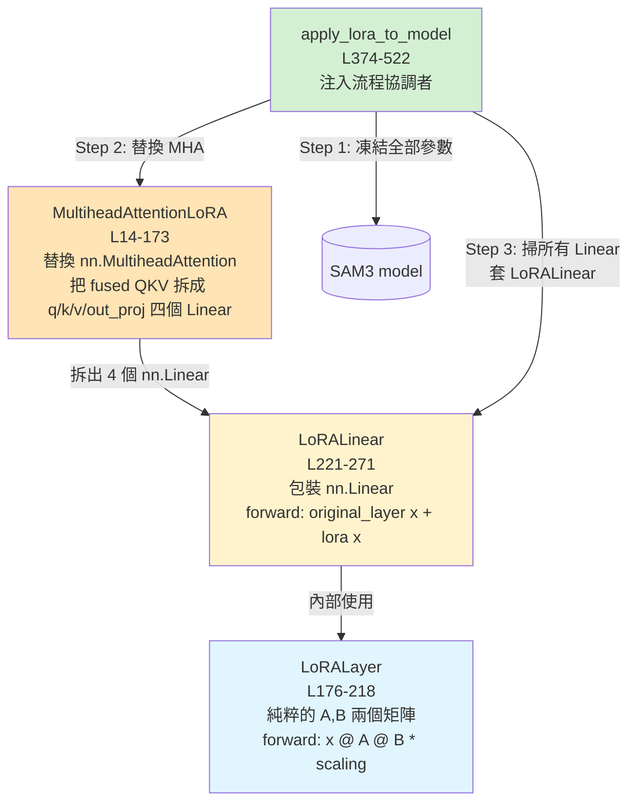

# 03 — LoRA 原理 + 凍結策略:Stage 1 的技術核心

> 系列第 3 份。前置:[01 總覽](01_sam3_lora_overview.md)、[02 SAM3 架構深解](02_sam3_architecture_deep.md)。
> 後續:[04 資料管線](04_data_pipeline_class_prompted_box.md)。

---

## 為什麼 LoRA 重要

工程師在 stage 1 做的所有事情,最後都會被存成一個 `best_lora_weights.pt` 檔。這個檔通常**只有幾 MB 到幾十 MB**(對比完整 SAM3 模型約 4-5 GB)。

讀完這份你會知道:
- 那幾 MB 裡到底裝了什麼
- 為什麼那麼小卻能改變模型行為
- 凍結策略的開關(`apply_to_*`)如何決定 LoRA 注入位置
- 為何「凍結 mask decoder」這個設計能成立

---

## LoRA 一句話心法

> **「凍結原權重 W,在它旁邊偷偷加一個小補丁 ΔW = B·A,只訓練補丁」**

```
原本:        y = W · x          (W 是 d_out × d_in 大矩陣,凍結)
LoRA 後:    y = W · x + (B · A) · x · (α/r)
                        └──┬──┘
                          ΔW
```

其中:
- **A** ∈ ℝ^(d_in × r),通常用 Kaiming 初始化
- **B** ∈ ℝ^(r × d_out),**初始化為 0**
- **r** = rank,通常很小(本專案用 16),`r ≪ min(d_in, d_out)`
- **α** = scaling factor(本專案用 32),`α/r` 控制補丁影響力強度

→ 對應到 `LoRALayer` @ `src/sam3/lora/lora_layers.py:176-218`,核心 forward 只有一行:
```python
# lora_layers.py:212-218
def forward(self, x):
    lora_out = self.dropout(x) @ self.lora_A @ self.lora_B
    return lora_out * self.scaling   # scaling = alpha / rank
```

### 為什麼 B 初始化為 0?

訓練剛開始時,B=0 → ΔW=0 → 模型行為**完全等於原模型**,不會破壞預訓練的能力。然後 B 才慢慢學起來。這是 LoRA 設計上的安全機制。

---

## 為什麼這樣有效?三個關鍵直覺

### 直覺 1:大模型 fine-tune 時的「實際變化」是低秩的

論文[^lora] 觀察:對 fine-tune 過的模型,W_finetuned − W_pretrained 這個差異矩陣的 rank 通常很低。換言之:**fine-tune 帶來的變化本來就在低維子空間**。

→ 直接用一個 r=16 的低秩矩陣 ΔW 去近似這個差異,在大多數任務上夠用。

[^lora]: Hu et al. 2021, *LoRA: Low-Rank Adaptation of Large Language Models*

### 直覺 2:可訓練參數量爆減

舉例:某個線性層 d_in=1024、d_out=1024。
- 全參數 fine-tune:1024 × 1024 = **1,048,576** 個參數
- LoRA r=16:1024×16 + 16×1024 = **32,768** 個參數
- 縮減比 = **32 倍**

整個 SAM3 套上 LoRA 後,**trainable 參數佔總參數的 0.1-0.5%**。`train_lora.py:186-190` 訓練啟動時會印出這個比例,你可以實際看到。

### 直覺 3:儲存與部署成本暴跌

訓練完只要存 A 和 B 兩個小矩陣(`save_lora_weights()` @ `lora_layers.py:580-600`)。
- 完整 SAM3 checkpoint:~4-5 GB
- LoRA only:**~10-50 MB**(取決於套了多少層)
- 推論時:載入完整 SAM3 + 套 LoRA + 載入 LoRA 權重 → 跟 fine-tune 完的模型行為等價

→ 這就是為什麼 `bsafe_cbd.yaml:31` 引用的是 `best_lora_weights.pt` 而不是某個 GB 級別的完整 checkpoint。

---

## 本專案的三層自寫類別(非 PEFT library)

工程師沒用 HuggingFace 的 `peft` library,而是**自己寫了 673 行**(`src/sam3/lora/lora_layers.py`)。為什麼?因為 SAM3 的 `nn.MultiheadAttention` 用了 fused QKV projection(`F.multi_head_attention_forward`),PEFT 不容易乾淨地塞進去——所以工程師連 MHA 都重寫了。



### 三層的職責分工

| 類別 | 行號 | 職責 | 為何分開 |
|---|---|---|---|
| `LoRALayer` | 176-218 | 純數學:A、B 兩個低秩矩陣 + forward 計算 | 可重用、容易測試 |
| `LoRALinear` | 221-271 | 包裝既有 `nn.Linear`:把原 layer 凍結 + 在它旁邊掛一個 `LoRALayer` | 主要工作單元,所有 Linear 都被它替換 |
| `MultiheadAttentionLoRA` | 14-173 | 重寫 `nn.MultiheadAttention`,**把 fused QKV 拆成 4 個獨立 Linear**(q_proj/k_proj/v_proj/out_proj) | 為了讓 LoRALinear 能套上 attention 的 4 個 projection |

→ **設計重點**:`MultiheadAttentionLoRA` 並不直接套 LoRA,它只是**把 attention 改造成「LoRA 友善」的結構**(分離 4 個 nn.Linear)。真正的 LoRA 注入是後續 `LoRALinear` 替換掃出來的所有 `nn.Linear` 時才發生。

---

## `apply_lora_to_model()` 注入流程白話化

`src/sam3/lora/lora_layers.py:374-522`,本專案最關鍵的函式之一。

### 步驟 1:凍結全部參數(`L390-392`)

```python
for param in model.parameters():
    param.requires_grad = False
```

注意:**先一律凍結再選擇性解凍**。這是「白名單」策略,比「黑名單」安全(不會漏掉應該凍結的東西)。

### 步驟 2:替換 `nn.MultiheadAttention`(`L459-492`)

掃整個模型樹,對每個 `nn.MultiheadAttention`:
1. 檢查 `should_apply_lora_to_component(name)`(看模塊路徑名跟 config 旗標的對應關係)
2. 用原 MHA 的權重初始化一個 `MultiheadAttentionLoRA`
3. 用 `setattr(parent, attr_name, new_mha)` 把舊的換掉
4. 新 MHA 也先設成 `requires_grad=False`(LoRA 套上去後才會解凍)

訓練 log 會印 `Replaced X nn.MultiheadAttention modules with MultiheadAttentionLoRA`。

### 步驟 3:套 LoRA 到所有匹配的 `nn.Linear`(`L496-514`)

掃所有 `nn.Linear`,對每個:
1. 檢查 `should_apply_lora(name)` = `should_apply_lora_to_component(name)` AND `matches_target_module(name)`
2. 通過檢查就用 `LoRALinear(module, rank, alpha, dropout)` 包起來,setattr 替換

訓練 log 會印 `Applied LoRA to N modules:` 加上前 15 個模塊名。

### 步驟 4:回傳模型,呼叫端拿可訓練參數給 optimizer

```python
# train_lora.py:202-203
self.optimizer = AdamW(
    [p for p in self.model.parameters() if p.requires_grad],  # ← 只有 LoRA 的 A、B 矩陣是 trainable
    lr=...,
)
```

→ 全部凍結 + 選擇性解凍的好處在這裡體現:**optimizer 自動跳過所有原權重**,只更新 LoRA 補丁。

---

## 凍結策略:`should_apply_lora_to_component()` 的真實邏輯

`src/sam3/lora/lora_layers.py:397-431`,**整個 stage 1 設計哲學的程式碼具現化**。

```python
def should_apply_lora_to_component(module_name: str) -> bool:
    if ("vision_encoder" or "vision_backbone" in name) and not config.apply_to_vision_encoder:
        return False
    if ("text_encoder" or "language_backbone" in name) and not config.apply_to_text_encoder:
        return False
    if "geometry_encoder" in name and not config.apply_to_geometry_encoder:
        return False
    if ("detr_encoder" or "transformer.encoder" in name) and not config.apply_to_detr_encoder:
        return False
    if is_decoder_text_attention_module(name):  # 例如 ".ca_text." 子模塊
        if not config.apply_to_detr_decoder: return False
        if not config.apply_to_decoder_text_attention: return False
    if ("detr_decoder" or "transformer.decoder" in name) and not config.apply_to_detr_decoder:
        return False
    if ("mask_decoder" or "segmentation_head" in name) and not config.apply_to_mask_decoder:
        return False  # ← stage 1 的核心:凍結 mask decoder
    return True
```

**讀法**:檢查 module 路徑名屬於哪個組件 → 對應 config 旗標 → 決定要不要套 LoRA。「白名單 + 黑名單複合」設計。

### ICG stage 1 配置實際對應(`configs/icglceaes_lora.yaml:33-39`)

| Component | 旗標值 | 結果 |
|---|---|---|
| Vision encoder / backbone | `true` | ✅ 套 LoRA(學 ICG 視覺特徵)|
| Text encoder / language backbone | `false` | ❌ 凍結(prompt 語意不動)|
| Geometry encoder | `false` | ❌ 凍結(stage 1 不用 box prompt)|
| DETR encoder | `true` | ✅ 套 LoRA(視覺+文字融合需要重新校準)|
| DETR decoder | `true` | ✅ 套 LoRA(box query 表徵需要重新校準)|
| Decoder text attention | `false` | ❌ 凍結(decoder 內部對文字的 cross-attention 維持)|
| **Mask decoder** | **`false`** | **❌ 完全凍結** |

---

## 為什麼凍結 mask decoder 還能產生新 mask?(再深入回答)

這是外科醫師最容易卡住的概念。**Mask decoder 凍結 = 它的權重沒動 = 但它的輸出可以變,因為輸入變了**。

### Mask 預測的數學

回顧 02 的內容:在 MaskFormer 思路下
```
mask[i, h, w] = sigmoid(query[i] · pixel_embedding[h, w])
                          ↑               ↑
                  decoder 輸出      vision encoder 輸出
                  (套了 LoRA)      (也套了 LoRA)
```

→ Mask decoder 本身**只負責這個內積運算 + 一些 refinement**(對應 `UniversalSegmentationHead`)。它的內部權重凍結沒關係,因為:
- `query[i]` 改變了 → 因為 decoder 套了 LoRA,query 表徵被重訓
- `pixel_embedding[h, w]` 改變了 → 因為 vision encoder 套了 LoRA,影像特徵被重訓
- **兩個輸入都變了 → 內積結果自然跟著變 → mask 跟著變**

### 類比

把 mask decoder 想成「相機快門」。快門本身不需要訓練——重點是:
- 對焦在哪(query 指向哪個物體)
- 場景是什麼樣子(pixel embedding 怎麼表示影像)

換 ICG 影像 = 換場景。換新訓的 LoRA = 重新對焦。快門本身不必動。

---

## LoRA 權重的儲存與載入

### 儲存(`save_lora_weights` @ L580-600)

```python
payload = {
    "state_dict": {  # 只有 LoRA 的 A、B 矩陣
        "module.path.lora.lora_A": tensor,
        "module.path.lora.lora_B": tensor,
        ...
    },
    "metadata": {
        "format_version": 2,
        "expected_keys": [...],          # 用於 load 時驗證
        "config": {                       # 完整 LoRAConfig 的 dict
            "rank": 16,
            "alpha": 32,
            "apply_to_vision_encoder": true,
            ...
        }
    }
}
torch.save(payload, save_path)
```

→ 因為只存 A、B,檔案非常小。`best_lora_weights.pt` 通常 < 50 MB。

### 載入(`load_lora_weights` @ L617-672)

設計上**很嚴格**:
1. 比對 `metadata.expected_keys` 跟當前模型的 LoRA 層名是否完全一致 → 不一致就丟錯
2. 比對 `metadata.config` 跟 `expected_config` 是否完全一致 → 不一致也丟錯
3. 比對每個 tensor shape 是否一致

→ **嚴謹的好處**:絕不會「LoRA config 是 r=8,但載入了 r=16 的 weights」這種隱性 bug。

### 推論時的載入流程(`infer_lora.py` 內)

```python
# 大致流程
model = build_sam3_image_model(load_from_HF=True)        # 1. 載基底 SAM3
lora_cfg = build_lora_config(yaml_lora_section)          # 2. 從 config 重建 LoRAConfig
model = apply_lora_to_model(model, lora_cfg)             # 3. 套上 LoRA(A=zero, B=zero)
load_lora_weights(model, "best_lora_weights.pt", lora_cfg)  # 4. 把訓好的 A、B 灌入
```

→ 注意:**載 LoRA 一定要先 `apply_lora_to_model` 建好結構**,不然層名對不上會丟錯。

---

## EndoScapes vs ICG 兩個 config 的 LoRA 差異對照

| 旗標 | `endoscapes_lora.yaml` | `icglceaes_lora.yaml`(stage 1 真用)|
|---|---|---|
| `rank` | 16 | 16 |
| `alpha` | 32 | 32 |
| `dropout` | 0.1 | 0.1 |
| `apply_to_vision_encoder` | true | true |
| `apply_to_text_encoder` | false | false |
| `apply_to_geometry_encoder` | false | false |
| `apply_to_detr_encoder` | true | true |
| `apply_to_detr_decoder` | true | true |
| `apply_to_decoder_text_attention` | false | false |
| **`apply_to_mask_decoder`** | **true** | **false** ← |
| `target_modules` 是否含 `mask_mlp` | **是** | **否** ← |
| `use_mask_loss`(training) | true | false |

→ 主要差異就在 mask decoder。EndoScapes 有 mask 標註所以連 mask decoder 也訓;ICG 只有 bbox 所以維持「object-agnostic mask decoder」設計。

→ 工程師原文「box-to-mask head was kept unchanged」明確對應到 ICG config 的設定。

---

## 「在 codebase 哪裡」速查表

| 議題 | 檔案 | 行號 |
|---|---|---|
| `LoRALayer`(數學核心) | `src/sam3/lora/lora_layers.py` | 176-218 |
| `LoRALinear`(包裝層) | `src/sam3/lora/lora_layers.py` | 221-271 |
| `MultiheadAttentionLoRA`(分離 QKV) | `src/sam3/lora/lora_layers.py` | 14-173 |
| `LoRAConfig`(完整參數定義) | `src/sam3/lora/lora_layers.py` | 274-371 |
| `apply_lora_to_model()`(注入流程) | `src/sam3/lora/lora_layers.py` | 374-522 |
| `should_apply_lora_to_component()`(凍結邏輯) | `src/sam3/lora/lora_layers.py` | 397-431 |
| `should_apply_lora()` + `matches_target_module()` | `src/sam3/lora/lora_layers.py` | 433-453 |
| `save_lora_weights` / `load_lora_weights` | `src/sam3/lora/lora_layers.py` | 580-672 |
| `count_parameters()`(訓練前列印用) | `src/sam3/lora/lora_layers.py` | 542-556 |
| Trainer 套 LoRA 的兩行 | `train/train_lora.py` | 183-184 |
| Trainer 篩 LoRA params 給 AdamW | `train/train_lora.py` | 202-211 |
| ICG config(stage 1 真用) | `configs/icglceaes_lora.yaml` | 19-44 |

---

## 常見疑問

### Q1:LoRA 不是 NLP 的東西嗎?用在 vision model 也適用?

A:**完全適用**。LoRA 只要求被作用的層是 `nn.Linear`(或 attention 的 projection)。Vision Transformer 跟語言模型的內部結構非常像(都是 transformer + linear projection),所以 LoRA 在 ViT、SAM、CLIP 上都很流行。

### Q2:rank=16 是怎麼選的?可以調嗎?

A:典型範圍 8-64。`rank` 越大 → 補丁容量越大 → 表達能力強但風險過擬合;反之則容量小、可能 underfit。本專案 16 是常見折衷。
- 想試:在 `configs/icglceaes_lora.yaml:20` 改成 8 或 32 跑兩次比較
- 注意:**rank 改了就要重訓**,舊的 `best_lora_weights.pt` 不能用(因為 shape 不對,`load_lora_weights` 會丟錯)

### Q3:`alpha/rank` 那個 scaling 是做什麼?

A:控制 LoRA 補丁的影響強度。`alpha=32, rank=16 → scaling=2.0`。理論上 alpha 越大補丁影響越大;**但實作上很多人就直接設 alpha=2*rank** 形成「scaling=2」的慣例。本專案就是這樣。

### Q4:可以同時用兩個 LoRA(例如針對兩個不同 dataset)嗎?

A:技術上可以(分別訓兩組,推論時分別載)。但本專案沒這需求——stage 1 只訓一組 LoRA(`runs/ibsafe_lora/2026-03-24-15-38/run_1/best_lora_weights.pt`),由 stage 2 引用。

### Q5:訓練啟動時看到 trainable_percentage 大概多少算正常?

A:**0.1% - 0.5%** 之間。例如總參數 12 億,LoRA trainable 約 100-600 萬。在 `train_lora.py:186-190` 啟動 log 會印確切數字,可以截下來作為訓練紀錄。

### Q6:如果想完全 fine-tune(不要 LoRA),應該怎麼做?

A:**這個 codebase 沒有那條路徑**——`train_lora.py` 強制走 LoRA 流程。要 full fine-tune 需要自己改 trainer(把 `for p in model.parameters(): p.requires_grad = False` 拿掉、不呼叫 `apply_lora_to_model`)。**強烈不建議**——VRAM 會爆,且效果未必更好。

---

## 本份筆記要帶走的 5 件事

1. ✅ **LoRA = 凍結原權重 W,在旁邊加 ΔW = B·A 補丁,只訓練補丁**
2. ✅ **B 初始化為 0 → 訓練起點等於原模型,安全微調**
3. ✅ **本專案自寫了 3 個類別:`LoRALayer`(數學)、`LoRALinear`(包裝)、`MultiheadAttentionLoRA`(拆 QKV)**
4. ✅ **`apply_lora_to_model()` 流程:全凍結 → 替換 MHA → 套 LoRA 到匹配的 Linear**
5. ✅ **凍結 mask decoder 仍能產生新 mask:因為 mask = query · pixel,兩個輸入都被 LoRA 改變了**

---

## 下一步

模型內部已經清楚了。下一份 **[04_data_pipeline_class_prompted_box.md](04_data_pipeline_class_prompted_box.md)** 會回答:**訓練資料怎麼變成模型的輸入?** 包括 COCO 標註如何讀、`"gallbladder"` 文字怎麼跟 box 對應上、ICG vs EndoScapes 兩個 dataset 在資料管線裡的差異。
