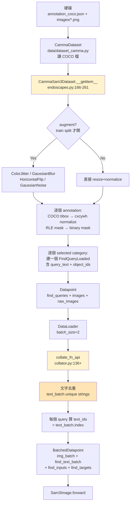
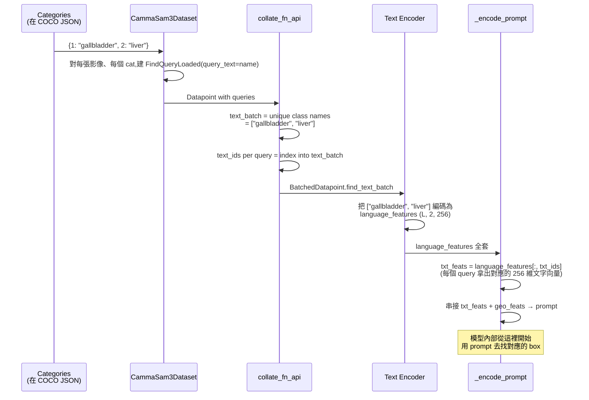

# 04 — 資料管線:從 COCO JSON 到 BatchedDatapoint

> 系列第 4 份。前置:[03 LoRA 原理與凍結](03_lora_principles_and_freeze.md)。
> 後續:[05 訓練流程 + Slurm](05_training_loop_and_slurm.md)。

---

## 為什麼要看資料管線

模型再強,**餵給它垃圾資料就會學垃圾**。stage 1 訓練的成敗八成取決於這一段。讀完這份你會知道:
- 標註檔(COCO JSON)裡每個欄位是什麼意思
- 一張影像 + 標註如何變成 `BatchedDatapoint` 餵進 SAM3 forward
- `class_names: ['gallbladder', 'liver']` 怎麼被轉成 `text_ids` 餵給 text encoder
- 兩個 dataset 的差異在資料端怎麼體現

---

## 完整資料流(從硬碟到模型)



---

## 資料夾結構(磁碟上長什麼樣)

```
{dataset_root}/
└── {dataset_name}/                 # e.g., ICG-LC-EAES
    ├── train/
    │   ├── images/                 # PNG / JPG 影像
    │   │   ├── frame_001.png
    │   │   ├── frame_002.png
    │   │   └── ...
    │   └── annotation_coco.json    # 標註檔(COCO 格式)
    ├── val/
    │   └── ...
    └── test/
        └── ...
```

`dataset_root` 與 `dataset_name` 由 config 指定:
- `configs/icglceaes_lora.yaml:7-8` →
  `/home2020/home/miv/vedrenne/data/camma/ICG-LC-EAES/`
- `configs/endoscapes_lora.yaml:7-8` → 同 root,改 `dataset_name: Endoscapes-Seg201-CBD`

→ **重要**:這兩個路徑都在 HPC 叢集上,你本機沒這份資料。要在本機跑需要請工程師給你副本(或自己打包標註)。

---

## COCO JSON 格式速覽

`annotation_coco.json` 的標準結構:

```json
{
  "images": [
    {"id": 1, "file_name": "frame_001.png", "width": 1920, "height": 1080},
    {"id": 2, "file_name": "frame_002.png", "width": 1920, "height": 1080}
  ],
  "annotations": [
    {
      "id": 100,
      "image_id": 1,
      "category_id": 1,
      "bbox": [320, 240, 200, 150],          // [x, y, w, h]
      "area": 30000,
      "segmentation": {                       // RLE 編碼或多邊形
        "size": [1080, 1920],
        "counts": "..."
      },
      "iscrowd": 0
    }
  ],
  "categories": [
    {"id": 1, "name": "gallbladder"},
    {"id": 2, "name": "liver"}
  ]
}
```

### bbox 的 anchor 約定(很重要!)

COCO 標準:`bbox = [x_topleft, y_topleft, width, height]`(左上角錨點)。

但**ICG-LC-EAES 用 center 錨點**(`bbox_anchor: center` @ `icglceaes_lora.yaml:14`),亦即 `bbox = [x_center, y_center, width, height]`。

→ 程式裡用 `coco_bbox_to_normalized_cxcywh()` 處理(`endoscapes.py:204-209`),會根據 config 的 `bbox_anchor` 自動轉成模型內部統一的 `cxcywh` 格式並歸一化到 [0, 1]。

→ **若要自己標一個新 dataset**,必須先確認 anchor 是哪個,寫進 config。錯了模型會學到偏移後的 box。

---

## `CammaSam3Dataset.__getitem__()` 逐步拆解

`src/sam3/data/endoscapes.py:166-261`,單筆資料如何處理。

### Step 1 – 讀檔 + 轉 PIL(`L167-169`)

```python
frame = self.dataset[self.indices[idx]]          # CammaDataset 給原始 numpy + 標註
pil_image = array_to_pil_rgb(frame.pixel_array)   # numpy → PIL.Image
orig_w, orig_h = pil_image.size
```

### Step 2 – Augmentation(僅 train split,`L171-189`)

| 操作 | 機率 | 強度 |
|---|---|---|
| ColorJitter(brightness/contrast/saturation/hue) | 80% | ±0.15 / ±0.15 / ±0.10 / ±0.02 |
| GaussianBlur | 20% | radius 0.1-1.25 |
| Horizontal flip | 50% | — |
| Gaussian noise | 25% | std 0-0.02 |

**為什麼這個組合?**
- ColorJitter:對抗手術室光源差異(冷光、不同廠牌內視鏡)
- Blur:對抗鏡頭起霧、霧化、抖動
- Hflip:左右對稱不變(膽囊長在右邊還是左邊不影響辨識)
- Noise:增加魯棒性

→ **沒有垂直翻轉、沒有大角度旋轉**——因為手術影像的方向有解剖學意義(腹腔上下、肝臟在上方),亂翻會誤導模型。

### Step 3 – Resize 到 1008×1008(`L177`)

```python
pil_image = resize_image_to_square(pil_image, self.resolution)
```

`resolution=1008`,對應 ViT 的 `img_size=1008`。所有訓練影像都會被 resize 成正方形。

### Step 4 – 處理每個 annotation(`L195-233`)

```python
for ann in frame.annotations:
    if ann.category_id not in selected_category_ids:
        continue
    box_tensor = coco_bbox_to_normalized_cxcywh(ann.bbox, orig_w, orig_h, bbox_anchor)
    if apply_horizontal_flip:
        box_tensor[0] = 1.0 - box_tensor[0]            # x 座標鏡像翻轉

    segment = decode_segmentation_mask(ann.segmentation)  # RLE → binary mask
    segment = resize_mask_to_square(segment, 1008)
    if apply_horizontal_flip:
        segment = torch.flip(segment, dims=[1])

    obj = Object(bbox=box_tensor, area=..., segment=segment, ...)
    objects.append(obj)
    category_to_object_ids[category_id].append(obj.object_id)
```

**注意**:
- 影像翻轉了 → bbox x 座標也要鏡像(`1.0 - x`)、mask 也要翻
- 不在 `selected_category_ids` 的 annotation 直接跳過(class filter)
- mask 解碼用 `pycocotools.mask.decode`,支援 RLE 與多邊形兩種格式
- ICG-LC-EAES 的 `use_mask_loss: false` → mask 即使解碼了也不會被當成 loss target

### Step 5 – 為每個 selected category 生成 `FindQueryLoaded`(`L237-259`)

**這是 class-prompted 機制的關鍵**:

```python
for category_id in self.selected_category_ids:
    object_ids = category_to_object_ids.get(category_id, [])
    if not object_ids and not self.include_negatives:
        continue                                     # 沒物體又不要負樣本就跳過
    queries.append(
        FindQueryLoaded(
            query_text=self.categories[category_id], # ← 文字 prompt(e.g. "gallbladder")
            image_id=0,
            object_ids_output=object_ids,            # 該類在這張影像的所有物體 ID
            is_exhaustive=True,                      # 這張影像該類的物體都已標完
            ...
        )
    )
```

**讀法**:每張影像針對「想找的每個類別」生成一個 query。例如 ICG config 有 2 類 → 每張影像產生 2 個 `FindQueryLoaded`(就算其中一類在這張影像沒物體,只要 `include_negatives=true` 也會生成空 query 當負樣本)。

→ 這就是工程師原文「**class-prompted bounding box supervision**」的具體實現:每個 query 帶著類別文字當 prompt,object_ids 對應到那個類在影像裡的真實 box。

### Step 6 – 包成 `Datapoint`(`L261`)

```python
return Datapoint(
    find_queries=queries,        # List[FindQueryLoaded]
    images=[image_obj],           # List[Image]
    raw_images=[pil_image]        # 用於 debug / 視覺化
)
```

---

## `collate_fn_api()` 怎麼把多個 Datapoint 組成 batch

`src/sam3/train/data/collator.py:136+`,DataLoader 的 collate function。

### 為什麼需要客製化 collate?

PyTorch 預設的 collate 假設每筆資料 shape 一致。但這裡每張影像的物體數量不同、query 數量也不同。所以要自己處理:
- 不同數量的 box 用 padding 對齊
- **文字 prompt 需要去重**(同一個 batch 內如果有兩張影像都要找 "gallbladder",text encoder 只需要編碼一次)

### 文字去重的核心兩行(`L218-220`)

```python
for q in data.find_queries:
    stage_id = q.query_processing_order
    if q.query_text not in text_batch:
        text_batch.append(q.query_text)             # ← 加入 unique 文字列表
    stages[stage_id].text_ids.append(
        text_batch.index(q.query_text)              # ← 記錄該 query 用 text_batch 第幾個
    )
```

**結果**(假設 batch 裡 2 張影像、每張 2 個 query):
- 影像 0:query["gallbladder"], query["liver"]
- 影像 1:query["gallbladder"], query["liver"]

→ `text_batch = ["gallbladder", "liver"]`(只有 2 個,不是 4 個)
→ `text_ids = [0, 1, 0, 1]`(每個 query 指回 text_batch 的索引)

### 結果:`BatchedDatapoint`

```python
BatchedDatapoint(
    img_batch:        Tensor (B, 3, 1008, 1008)         # 所有影像疊起來
    find_text_batch:  List[str]                          # 去重後的 unique class 名
    find_inputs:      List[FindStage]                    # 每個 stage 的索引(text_ids、img_ids、boxes)
    find_targets:     List[BatchedFindTarget]            # GT boxes、masks、object_ids
    find_metadatas:   List[BatchedInferenceMetadata]    # 用於後處理對應原圖
    raw_images:       Optional[List[PIL.Image]]
)
```

→ 最後送進 `Sam3Image.forward(batched)` @ `sam3_image.py:501`。

---

## 兩個 dataset 在資料管線裡的差異對照

| 維度 | Endoscapes-Seg201-CBD | ICG-LC-EAES(stage 1 真用) |
|---|---|---|
| 類別數 | 6(膽囊管/動脈/Calot/囊區板/膽囊/工具)| **2(膽囊、肝臟)** |
| `bbox_anchor` | topleft | **center** |
| `selected_class_names` | 全 6 類(`endoscapes_lora.yaml:15-21`)| **`gallbladder, liver`(`icglceaes_lora.yaml:15-17`)** |
| 影像光譜 | 一般白光腹腔鏡 | **ICG 螢光成像** |
| 是否有 segmentation mask | ✅ 有(RLE 編碼)| ❌ 只有 bbox |
| `use_mask_loss` | `true` | **`false`** |
| `include_negatives` | `true` | `true`(兩者都收負樣本)|
| augmentation | 全套(color/blur/flip/noise)| 同 |
| `__getitem__` 處理流程 | 同 | 同 |

→ 程式碼**一份共用**(`CammaSam3Dataset`),差異全靠 config 決定。

---

## 文字 prompt 怎麼和 box 對應上(完整資料流)

這是最容易看不清楚的一段。整個流程:



→ 重點:**訓練時模型不直接看到 "gallbladder" 這個字串**,它看到的是 text encoder 編出來的 256 維向量 + 一個 `text_ids` 索引告訴它「這個 query 對應 text_batch 第幾條」。

---

## 資料增強對 stage 1 的特殊考量

### 為什麼 augment 對 ICG 訓練特別重要

ICG-LC-EAES dataset 估計只有幾百到幾千張。對深度學習算「**小樣本**」。沒 augment 模型很快就背題:
- 訓練集精度 99% 但驗證集 60%(過擬合)

augment 讓模型每個 epoch 看到「同一張影像的不同變形版本」,等同把資料量虛擬擴大數倍。

### 為什麼 hflip 概率設 50% 而不是更高

外科解剖學上,左右翻轉不會破壞語意(膽囊位置是相對於肝臟,不是絕對左右)。但**模型不能完全忽略方向資訊**(不然手術器械方向也會被當隨機,反而傷判讀)。50% 是經驗折衷。

### 為什麼沒有 mixup / cutmix / random crop

- **mixup/cutmix**:會混合兩張影像的內容,語意上不合理(兩個病人的器官疊在一起)
- **random crop**:可能把目標器官切掉,讓 box ground truth 不準

→ 醫療影像 augment 通常**比一般 ImageNet 任務保守**。

---

## 「在 codebase 哪裡」速查表

| 議題 | 檔案 | 行號 |
|---|---|---|
| `CammaSam3Dataset` 主類別 | `src/sam3/data/endoscapes.py` | 111-265 |
| `__getitem__` 主流程 | `src/sam3/data/endoscapes.py` | 166-261 |
| Augmentation pipeline | `src/sam3/data/endoscapes.py` | 154-189 |
| bbox COCO → cxcywh 轉換 | `src/sam3/data/endoscapes.py` | 204-211 |
| Mask 解碼 | `src/sam3/data/endoscapes.py` | 213-223 |
| FindQueryLoaded 生成 | `src/sam3/data/endoscapes.py` | 237-259 |
| Class name 解析 | `src/sam3/data/endoscapes.py` | 35-70 |
| `coco_bbox_to_normalized_cxcywh` | `src/sam3/image_utils.py` | (utility) |
| `CammaDataset`(底層 COCO 讀取) | `src/data/dataset_camma.py` | 全檔 |
| `collate_fn_api` | `src/sam3/train/data/collator.py` | 136+ |
| 文字去重核心 | `src/sam3/train/data/collator.py` | 218-220 |
| `BatchedDatapoint` 結構 | `src/sam3/model/data_misc.py` | 159-165 |
| `FindStage` 結構 | `src/sam3/model/data_misc.py` | 61-82 |
| Trainer 的 DataLoader 組裝 | `train/train_lora.py` | 440-497 |

---

## 常見疑問

### Q1:如果我想加新類別(例如 "duodenum"),要改幾個地方?

A:
1. 在 COCO JSON 的 `categories` 加新條目(id 接續、name 取個字串)
2. 在 `annotations` 加新類的標註(bbox + 可選 segmentation)
3. 在 config 的 `class_names` 加上 `"duodenum"`
4. 重新跑 `train_lora.py` —— **程式碼不需改**

→ 這就是 class-prompted 機制的優點:加類別只是資料工程,不是程式工程。

### Q2:`include_negatives: true` 會做什麼?

A:會讓 dataset 給沒有物體的類別也生成 `FindQueryLoaded`(只是 `object_ids_output=[]`)。這對訓練很重要——讓模型學會「**這張影像沒有膽囊時要說沒有,而不是亂指**」。

### Q3:augment 流程裡如果某張影像沒被翻轉、但同 batch 另一張被翻了,會出問題嗎?

A:不會。augment 是 per-sample,影像翻轉時對應的 box 也會跟著翻(`L211, L222-223`)。同 batch 內每張影像各自獨立處理。

### Q4:文字去重會不會影響訓練?例如 batch 裡兩張影像都找 "gallbladder",合併後模型怎麼分得清?

A:`text_ids` 處理了這個對應。collator 紀錄「query 0 對應 text_batch[0]、query 1 對應 text_batch[1]、query 2 對應 text_batch[0]、query 3 對應 text_batch[1]」這種索引。模型 forward 時用 `text_ids` 抓對應的文字 feature(`sam3_image.py:179-181`),不會搞混。

### Q5:訓練時 batch_size=2 太小,可以開到 8 嗎?

A:**取決於 VRAM**。SAM3 高解析度(1008²)+ ViT-L 對 VRAM 很吃。在 H100 (80GB) 上 batch_size=2 + grad accumulation 8(等效 batch 16)是工程師選的設定。
- 想試更大 batch:先把 grad accumulation 降下來、再慢慢調 batch
- 也可考慮把 `gradient_accumulation_steps` 從 8 降到 4,等效 batch 8(但 batch_size 仍 2)
- **Auto Mixed Precision (bf16) 已經開了**(`mixed_precision: bf16`),不能再省

### Q6:資料路徑都在 HPC 上,我本機要怎麼跑 smoke test?

A:工程師有貼心準備 `endoscapes_lora_smoke.yaml`(`device: cpu`、`num_epochs: 1`、`batch_size: 1`)。但仍需要本機有那份資料。**建議**:跟工程師要一個 **mini subset**(例如 train: 5 張、val: 2 張),跟 smoke config 配對,自己跑 1 個 epoch 確認程式能 launch。

---

## 本份筆記要帶走的 5 件事

1. ✅ **資料來自 COCO JSON,影像在 `images/`、標註在 `annotation_coco.json`**
2. ✅ **每張影像 + 每個 selected category → 一個 `FindQueryLoaded`**(class-prompted 機制)
3. ✅ **collator 對文字 prompt 去重 + 用 `text_ids` 建立 query-text 對應**
4. ✅ **augment 流程針對手術影像保守設計**(無垂直翻、無 mixup、無 crop)
5. ✅ **兩個 dataset 共用一份 `CammaSam3Dataset` 程式碼**,差異全靠 config 與 `bbox_anchor`

---

## 下一步

進入 **[05_training_loop_and_slurm.md](05_training_loop_and_slurm.md)** — 模型懂了、資料懂了,下一份會把 `train_lora.py` 的訓練主迴圈、Loss 組合、AdamW + cosine、bf16 mixed precision、DDP 多卡、以及 Slurm 提交腳本一次講完,讓你真的能在 HPC 上 submit job。
