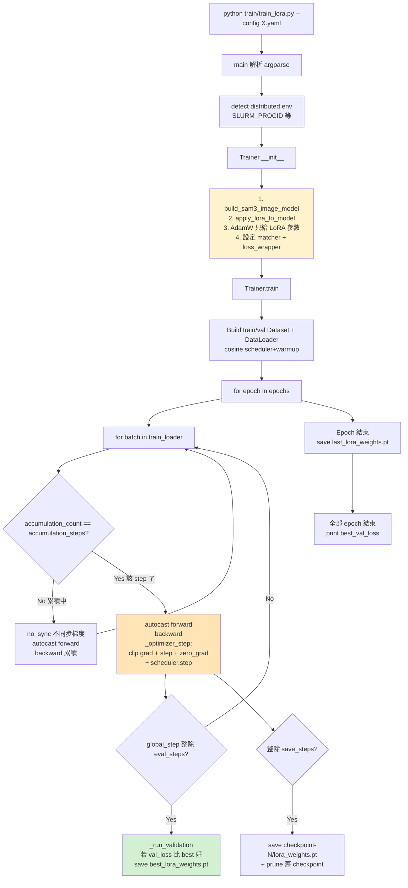

# 05 — 訓練主迴圈 + Loss 組合 + Slurm 提交

> 系列第 5 份。前置:[04 資料管線](04_data_pipeline_class_prompted_box.md)。
> 後續:[06 推論 + 評估 + 實操](06_inference_eval_handson_recipe.md)。

---

## 為什麼這份很重要

- 真的要在 HPC 上 submit 一個訓練 job,需要懂 Slurm 腳本怎麼寫、怎麼讀錯誤訊息
- 訓練 log 印出的 `loss=2.3, lr=4.7e-5`,你要能解讀含義
- 訓練到一半失敗時,要能看訓練主迴圈的程式碼定位問題
- gradient accumulation、DDP、bf16 這些技巧不懂,訓練設定會抄錯

---

## 訓練主迴圈鳥瞰



**讀圖**:
- 黃色 = 一次性初始化(模型 + LoRA + optimizer + loss)
- 橘色 = 訓練主路徑(forward → backward → step)
- 綠色 = 模型保存點

---

## Trainer 類別關鍵段落

`train/train_lora.py` 全檔約 645 行。主要函式:

| 函式 | 行號 | 職責 |
|---|---|---|
| `__init__` | 136-258 | 建模型 + LoRA + AdamW + Loss wrapper + AMP |
| `_setup_amp` | 267-278 | 設定 bf16 / fp16 混合精度 |
| `_autocast_context` | 280-283 | 提供 autocast context manager |
| `_compute_total_loss` | 322-327 | forward → 算 matcher 索引 → 算 loss |
| `_sync_gradients` | 329-336 | 多 GPU 時手動 all_reduce 梯度 |
| `_optimizer_step` | 338-351 | clip grad + step + zero_grad + scheduler.step |
| `_save_lora_file` | 353-357 | 存 LoRA 權重(只 A、B 矩陣)|
| `_save_checkpoint` | 359-366 | 存 checkpoint-N 資料夾 |
| `_run_validation` | 405-428 | 跑驗證集算平均 loss |
| `train` | 430-599 | 主迴圈(epoch × batch × accumulation × step)|

---

## Loss 組合的細節

`__init__` 第 222-252 行,**stage 1 訓練的 loss 由三個成分組成**:

### 1. `Boxes`:bbox 回歸 loss(L1 + GIoU)

```python
Boxes(weight_dict={"loss_bbox": 5.0, "loss_giou": 2.0})
```
- `loss_bbox`:預測 box 與 GT box 的 L1 distance(座標 4 維直接相減取絕對值)
- `loss_giou`:Generalized IoU loss(比 IoU 更穩健,當兩個 box 不重疊時還能給梯度)

### 2. `IABCEMdetr`:類別分類 + presence loss(focal CE)

```python
IABCEMdetr(
    pos_weight=10.0,
    weight_dict={"loss_ce": 20.0, "presence_loss": 20.0},
    pos_focal=False,
    alpha=0.25, gamma=2,
    use_presence=True,
    pad_n_queries=200,
)
```
- `loss_ce`:每個 query 對「是不是這個類別」的二元分類(focal loss with pos_weight=10)
- `presence_loss`:整體判斷「這張影像有沒有該類物體」的二元分類

→ **為什麼權重設 20**:相對 box loss(5+2),class loss 故意提高,因為類別決定錯了 box 多準也沒用。

### 3. `Masks`(可選,僅 `use_mask_loss=true` 時加入)

```python
Masks(weight_dict={"loss_mask": 200.0, "loss_dice": 10.0},
      focal_alpha=0.25, focal_gamma=2.0, compute_aux=False)
```
- `loss_mask`:像素級 sigmoid focal loss
- `loss_dice`:Dice loss(對 mask 的形狀敏感)
- 權重 200+10 是因為 mask 是 H×W 張量,每像素 loss 加總,所以單個 component 的 magnitude 很大,要用低權重 normalize

→ **stage 1 用 ICG config(`use_mask_loss: false`)→ Masks loss 不加入**。只訓 Boxes + IABCEMdetr。

### Matcher:Hungarian + One-to-Many(L213-219)

```python
self.matcher = BinaryHungarianMatcherV2(
    cost_class=2.0, cost_bbox=5.0, cost_giou=2.0, focal=True,
)
o2m_matcher = BinaryOneToManyMatcher(alpha=0.3, threshold=0.4, topk=4)
```

**功能**:把模型 N 個 prediction queries 跟 GT box 配對。
- **O2O**(Hungarian):每個 GT 配一個 query(經典 DETR)。產生 `pred_logits` 跟 `loss_ce`、`loss_bbox` 等 loss
- **O2M**:每個 GT 可配多個 query(top-k=4),用於加速收斂與提升 recall

→ Loss 同時對 O2O 與 O2M 計算,加權合併(`o2m_weight=2.0` @ L248)。

### `Sam3LossWrapper`(L244-252)

```python
self.loss_wrapper = Sam3LossWrapper(
    loss_fns_find=loss_fns_find,    # [Boxes, IABCEMdetr, Masks?]
    matcher=self.matcher,
    o2m_matcher=o2m_matcher,
    o2m_weight=2.0,
    use_o2m_matcher_on_o2m_aux=False,
    normalization=normalization,    # global / local
    normalize_by_valid_object_num=False,
)
```

→ 這個 wrapper 把所有 loss 算完、按權重加總成單一 scalar `total_loss`,`backward()` 在這上面跑。

---

## Optimizer + Scheduler

### AdamW(`L202-211`)

```python
self.optimizer = AdamW(
    [p for p in self.model.parameters() if p.requires_grad],   # ← 只給 LoRA 參數
    lr=5e-5,
    betas=(0.9, 0.999),
    eps=1e-8,
    weight_decay=0.01,
)
```

**注意 lr=5e-5 對 LoRA 不算很小**——因為 LoRA 是從零開始訓的補丁(B 初始為 0),需要稍大 lr 才能學起來。

### Cosine Scheduler with Warmup(`L508-513`)

```python
self.scheduler = get_scheduler(
    name="cosine",
    optimizer=self.optimizer,
    num_warmup_steps=200,
    num_training_steps=epochs * ceil(len(train_loader) / accumulation_steps),
)
```

LR 變化:
```
0 ────warmup───→ 5e-5 ──cosine──→ 0
        |                  |
   step 0-200       step 201-end
```

→ Warmup 200 步:從 0 線性升到 5e-5,讓初期 B 矩陣穩定學起來
→ Cosine 衰減:其餘步數慢慢從 5e-5 降到 ~0,讓模型穩定收斂

---

## Mixed Precision(bf16)

`_setup_amp` @ L267-278 + `_autocast_context` @ L280-283。

### 為什麼用 bf16 不用 fp16

| | fp16 | bf16 |
|---|---|---|
| 數值範圍 | 較窄 | 跟 fp32 一樣寬 |
| 精度 | 較高 | 較低 |
| 需要 GradScaler? | **是** | **否**(範圍夠寬,梯度不會 underflow) |
| 適合場景 | 較舊 GPU | A100、H100 等新 GPU |

→ 本專案用 H200/H100/A100 → 適合 bf16,訓練程式碼也乾淨(不用 GradScaler)。

### 實際使用(`L280-283 + L540-541`)

```python
def _autocast_context(self):
    if not self.amp_enabled:
        return contextlib.nullcontext()
    return torch.amp.autocast(device_type="cuda", dtype=self.amp_dtype)

# 在 forward 裡用:
with self._autocast_context():
    total_loss = self._compute_total_loss(input_batch)
```

→ 模型 forward 用 bf16 算(省一半 VRAM、約 1.5-2x 速度);梯度仍是 fp32 累積(透過 PyTorch autocast 自動處理)。

---

## Gradient Accumulation(節省 VRAM 的關鍵)

### 為什麼需要

理想 batch size 16 才訓得穩定,但 H100 80GB 只裝得下 batch=2(因為 SAM3 大、影像 1008²)。**解法**:跑 8 個 batch=2,把梯度累積起來,**等於一次 batch=16 的更新**。

### 程式邏輯(L499 + L532-555)

```python
accumulation_steps = 8           # config 設定

for batch in train_loader:
    accumulation_count += 1
    should_step = (accumulation_count == accumulation_steps)

    sync_context = (
        self.model.no_sync()      # ← 累積中不同步梯度(DDP 才用)
        if self.multi_gpu and not should_step
        else contextlib.nullcontext()
    )

    with sync_context:
        with self._autocast_context():
            total_loss = self._compute_total_loss(input_batch)
            scaled_loss = total_loss / accumulation_steps   # ← 等比例縮小
        scaled_loss.backward()                              # ← 累積到 .grad

    if should_step:
        self._optimizer_step(max_grad_norm)                 # ← optimizer + scheduler step
        accumulation_count = 0
```

→ 重點:
1. `loss / accumulation_steps`:讓累積後的梯度 magnitude 跟「真的 batch=16」一致
2. `model.no_sync()`:DDP 多 GPU 時,累積中間不同步 → 節省通訊成本
3. 最後一步才 `optimizer.step()`,真正更新權重

---

## DDP 多 GPU 訓練

### 環境變數偵測(`L72-99`)

從 SLURM 環境變數推斷分散式設定:
- `SLURM_PROCID` → rank(全域第幾個 process)
- `SLURM_NTASKS` → world_size(總 process 數)
- `SLURM_LOCALID` → local_rank(本機第幾個 GPU)

### 模型包 DDP(`L193-199`)

```python
if self.multi_gpu:
    self.model = DDP(
        self.model,
        device_ids=[self.local_rank],
        output_device=self.local_rank,
        find_unused_parameters=False,
    )
```

`find_unused_parameters=False` 是因為**所有 LoRA 參數每 forward 都會被用到**(沒有條件分支跳過)。設成 True 會吃效能。

### 手動梯度同步(`L329-336`)

雖然 DDP 預設會自動同步,但 `no_sync()` + accumulation 模式下,作者選擇**最後一個 batch 才手動 all_reduce**:

```python
def _sync_gradients(self):
    for param in self.model.parameters():
        if param.grad is None:
            continue
        dist.all_reduce(param.grad, op=dist.ReduceOp.SUM)
        param.grad.div_(self.world_size)        # 平均化
```

→ 這段在 epoch 結尾不滿一個 accumulation_steps 時才用(L579-581)。

---

## Validation 與 Checkpoint

### Validation(`_run_validation` @ L405-428)

每 `eval_steps`(預設 20)跑一次:
- 在 val_loader 上跑 forward + loss(no_grad、eval 模式)
- 多 GPU 時 all_reduce 平均 loss
- 把模型切回 train 模式

### Checkpoint 儲存策略

| 何時 | 存什麼 | 路徑 |
|---|---|---|
| **val_loss 比歷史最佳好**(eval 後判斷)| LoRA only(A、B 矩陣)| `out_dir/best_lora_weights.pt` |
| 每 `save_steps` | LoRA + 所在 checkpoint 資料夾 | `out_dir/checkpoint-{step}/lora_weights.pt` |
| 每個 epoch 末 | LoRA only | `out_dir/last_lora_weights.pt` |

→ `save_total_limit: 5` 控制 checkpoint 數量(`_prune_old_checkpoints` @ L368-386)。
→ **生產用 `best_lora_weights.pt`**(跨 epoch 最低 val_loss 的版本),`last_lora_weights.pt` 只是訓練紀錄。

### 為什麼 checkpoint 只存 LoRA 不存 optimizer state

- **不能斷點續訓**(因為 optimizer momentum / scheduler state 都沒存)
- 但 LoRA 訓練短(15 epochs 幾小時),斷掉就重跑沒大影響
- 換來的好處:**checkpoint 檔案小**(<50 MB vs 5 GB+)

→ 若要支援續訓,要自己改 trainer。但工程師沒這需求。

---

## Slurm 提交腳本

`slurm/schedule_train.py` 全 155 行。它的工作:**生成一份 SLURM job script + 自動 sbatch 提交**。

### 用法

```bash
python slurm/schedule_train.py \
    --config configs/icglceaes_lora.yaml \
    --experiment ibsafe_lora \
    --num-runs 1
```

→ 會在 `./runs/ibsafe_lora/{timestamp}/run_1/` 建立資料夾,包含:
- `icglceaes_lora.yaml`(複製 + 改 `output.output_dir` 指向 run 目錄)
- `train_run_1.job`(完整 SLURM script,包含 srun 命令)

### 生成的 SLURM script 結構(`get_script` @ L11-84)

```bash
#! /bin/bash
#SBATCH -p pri2021gpu -A qoscammagpu2     # partition + account
#SBATCH -N 1                               # 1 node
#SBATCH -n 2                               # 2 tasks(對應 2 個 GPU)
#SBATCH --tasks-per-node 2
#SBATCH --gres=gpu:2                       # 2 GPUs per node
#SBATCH -c 8                               # 8 CPU cores per task
#SBATCH --mem=32G                          # 32 GB host memory
#SBATCH -o {output_log_path}
#SBATCH --constraint="gpuh200|gpuh100|gpua100hgx|gpua100|gpua40|gpul40s|gpuv100"

# Environment
module load cuda/cuda-11.8 gcc/gcc-11 matlab/r2020b
source /home2020/home/miv/vedrenne/mambaforge/etc/profile.d/conda.sh
mamba activate py311cu118
cd {working_dir}

# 印環境資訊(hostname / GPU / VRAM)
hostname; nvidia-smi --query-gpu=name; ...

# Distributed env
export NCCL_DEBUG=INFO
export TORCH_DISTRIBUTED_DEBUG=DETAIL
export MASTER_ADDR=$(scontrol show hostnames "$SLURM_NODELIST" | head -n 1)
export MASTER_PORT=$((10000 + SLURM_JOB_ID % 50000))

# Launch
srun python train/train_lora.py --config {config_path}
```

**設計重點**:
- `--constraint` 列了多種 GPU 型號(從 H200 到 V100 都接受)→ 排程更容易拿到資源
- `srun` 自動把 process 撒到所有 task(2 個 GPU 上各跑一個)
- `MASTER_PORT` 用 `SLURM_JOB_ID % 50000` 避免不同 job 撞 port

### 自動建立 run 目錄結構(`schedule` @ L87-118)

```
runs/
└── ibsafe_lora/                    # experiment name
    └── 2026-04-30-15-38/           # 自動加 timestamp
        └── run_1/                  # 多次跑就 run_1, run_2, ...
            ├── icglceaes_lora.yaml # 複製過來的 config
            ├── train_run_1.job     # 生成的 SLURM script
            ├── train_run_1.out     # SLURM stdout log(訓練後產生)
            ├── best_lora_weights.pt
            ├── last_lora_weights.pt
            ├── val_stats.jsonl
            └── checkpoint-X/
                └── lora_weights.pt
```

→ **每次跑會把 config 複製進來**,所以你之後翻 run 紀錄時,知道每個 run 用的是哪份 config(避免「我那次到底改了什麼?」的困擾)。

→ `bsafe_cbd.yaml:30-31` 引用的就是某個 `runs/ibsafe_lora/{timestamp}/run_1/best_lora_weights.pt`,使用者可以從那邊回溯訓練設定。

---

## 訓練 log 怎麼讀

當 SLURM job 開始跑,`train_run_1.out` 會逐步出現:

```
Hostname.........: gpu-node-12
GPU name.........: NVIDIA H100 80GB HBM3
GPU memory total.: 81920 MiB
...

Building SAM3 model...
Applying LoRA...
Replaced 88 nn.MultiheadAttention modules with MultiheadAttentionLoRA
Applied LoRA to 1247 modules:
  - backbone.vision_backbone.trunk.blocks.0.attn.qkv
  - backbone.vision_backbone.trunk.blocks.0.attn.proj
  ...
  ... and 1232 more
Trainable params: 4,521,856 (0.36%)

Loading training data from /home2020/.../camma (ICG-LC-EAES)...
Training for 15 epochs (1875 optimizer steps)

Epoch 1/15: 100%|██| 1000/1000 [12:34<00:00, loss=8.3421, lr=4.21e-5]
Step 20: train_loss=8.5212, val_loss=8.1234
Step 40: train_loss=7.9821, val_loss=7.6543
...
Epoch 1: train_loss=7.4321, val_loss=7.0987
```

**幾個解讀重點**:
- **`Trainable params: X (Y%)`**:Y 通常 0.1-0.5%,代表 LoRA 設定合理
- **`Replaced X MHA + Applied LoRA to N modules`**:確認 LoRA 真的被注入(N 通常 1000+)
- **loss 趨勢**:val_loss 應該慢慢降,如果**升回來了 = 過擬合**(LoRA dropout 不夠 / lr 太大 / epochs 太多)
- **lr 變化**:warmup 期間從 0 升到 5e-5,之後 cosine 緩降
- **best_lora_weights.pt 何時更新**:每次 val_loss 創新低就會印 + 存檔

---

## 常用調整速查

| 想做的事 | 改什麼 |
|---|---|
| 跑得更快 | 減 epochs;或減 gradient_accumulation_steps(但 effective batch 變小,可能傷穩定)|
| 防過擬合 | 增 LoRA dropout(0.1 → 0.2);或減 epochs |
| 訓練不穩定 / loss 爆炸 | 降 learning_rate(5e-5 → 2e-5);或增 warmup_steps |
| VRAM 不夠 | 降 batch_size(2 → 1);或增 gradient_accumulation_steps 補回 effective batch |
| 想試大 batch | 增 GPU 數(`#SBATCH --gres=gpu:N`)+ 對應改 `-n N` 跟 `--tasks-per-node N` |
| 換新 dataset | 改 config 的 `data.dataset_name`;不需改程式 |
| 只訓單一類別 | 改 `data.class_names: [target_class]` 或 `--class-names` 命令列覆寫 |

---

## 「在 codebase 哪裡」速查表

| 議題 | 檔案 | 行號 |
|---|---|---|
| **訓練主入口** | `train/train_lora.py` | 644-645 |
| Trainer `__init__` | `train/train_lora.py` | 136-258 |
| Build SAM3 + LoRA(兩行)| `train/train_lora.py` | 173-184 |
| AdamW(只給 LoRA)| `train/train_lora.py` | 202-211 |
| Matcher 設定 | `train/train_lora.py` | 213-219 |
| Loss 組合(Boxes/IABCEMdetr/Masks)| `train/train_lora.py` | 222-242 |
| Sam3LossWrapper | `train/train_lora.py` | 244-252 |
| AMP setup | `train/train_lora.py` | 267-278 |
| `_compute_total_loss` | `train/train_lora.py` | 322-327 |
| `_optimizer_step`(clip + step)| `train/train_lora.py` | 338-351 |
| `_save_lora_file` | `train/train_lora.py` | 353-357 |
| `_run_validation` | `train/train_lora.py` | 405-428 |
| **`train()` 主迴圈** | `train/train_lora.py` | 430-599 |
| Cosine scheduler 設定 | `train/train_lora.py` | 508-513 |
| Gradient accumulation 邏輯 | `train/train_lora.py` | 532-555 |
| Best/Last checkpoint 判斷 | `train/train_lora.py` | 572-593 |
| `main()` argparse | `train/train_lora.py` | 607-645 |
| **Slurm 提交工具** | `slurm/schedule_train.py` | 全檔 |
| SLURM job script template | `slurm/schedule_train.py` | 11-84 |
| `schedule()`:複製 config + sbatch | `slurm/schedule_train.py` | 87-118 |

---

## 常見疑問

### Q1:訓練要跑多久?

A:根據 ICG dataset 大小(估幾百到幾千張),`num_epochs: 15`、batch_size 2、grad accumulation 8(等效 batch 16)、2× H100:
- 估計 **3-8 小時**
- 真實時間看 SLURM `train_run_1.out` 開頭印的 hostname 與 GPU 型號,以及進度條
- Wall time 上限可在 sbatch 加 `#SBATCH --time=12:00:00`(這版預設沒設,**長時間 job 建議自己加**避免被排程系統殺掉)

### Q2:訓練中途看 loss 不錯,可以提早停嗎?

A:Slurm 上 `scancel <JOB_ID>` 即可。**`best_lora_weights.pt` 已經存好**,可以直接用。但**目前的 trainer 不支援自動 early stopping**,要的話得自己改。

### Q3:訓練 log 顯示 `loss=NaN` 怎麼辦?

A:幾個診斷方向(由近到遠)——
1. **檢查 dataset**:有沒有空 batch(`include_negatives=true` 設了嗎?第一個 batch 全是負樣本可能讓 loss 算不出來)
2. **降 lr**:`5e-5 → 2e-5`
3. **增 warmup**:`200 → 500`,讓初期更平穩
4. **檢查 grad_norm**:`max_grad_norm: 1.0` 應該已經 clip 了,但若 forward 直接出 NaN 就 clip 不到了
5. **回 fp32**:把 `mixed_precision: bf16 → none` 看是否 AMP 引起
6. **看具體哪個 loss component NaN**:暫時把 loss_wrapper 改成印每個 component(需要改程式)

### Q4:`val_stats.jsonl` 是什麼?

A:每次 validation 後寫一行 JSON 進去:
```json
{"epoch": 0, "global_step": 20, "learning_rate": 4.21e-05, "train_loss": 8.52, "val_loss": 8.12}
```
→ 可以用 pandas 讀進來畫 train/val curve:
```python
import json, pandas as pd
df = pd.read_json("runs/ibsafe_lora/.../run_1/val_stats.jsonl", lines=True)
df.plot(x="global_step", y=["train_loss", "val_loss"])
```

### Q5:多 GPU 訓練的等效 batch size 是多少?

A:`batch_size × accumulation_steps × num_gpus`。
- ICG config:2 × 8 × 2 = **等效 batch 32**
- 若改成 4 GPU 不變其他設定 → 等效 batch 64(可能要重調 lr,因為更穩定 = 可以 lr 更大)
- 一個常見規則:**linear scaling rule** —— batch 變 2 倍,lr 也變 2 倍

### Q6:DDP 跟 DataParallel 哪個用了?

A:**DDP**(`torch.nn.parallel.DistributedDataParallel`,@ L194)。DDP 比 DP 快很多(不需要 master rank gather/scatter),是現代多 GPU 訓練標準。

### Q7:可以在筆電 / 工作站跑嗎?

A:**完整訓練幾乎不可能**(ViT-L 模型 + 1008² 影像吃 VRAM 嚴重)。但可以:
- 用 `endoscapes_lora_smoke.yaml`(`device: cpu`、`batch=1`、`epochs=1`)做**程式碼能 launch 的 smoke test**
- 或在 GPU 工作站(RTX 3090/4090 24GB)上跑單 GPU + bf16 + batch=1 + accumulation=16
- **真的訓練還是回 HPC**

---

## 本份筆記要帶走的 7 件事

1. ✅ **Optimizer 只接 LoRA 參數**(`p.requires_grad` 過濾)
2. ✅ **Loss = Boxes(L1+GIoU)+ IABCEMdetr(focal+presence)+ optional Masks**
3. ✅ **Cosine scheduler + 200 步 warmup**
4. ✅ **bf16 不需 GradScaler;fp16 需要**
5. ✅ **Gradient accumulation 用 `loss / steps + no_sync()` 模擬大 batch**
6. ✅ **Best 模型 = val_loss 創新低時存的 `best_lora_weights.pt`**
7. ✅ **Slurm 提交用 `python slurm/schedule_train.py --config X --experiment Y`**

---

## 下一步

進入最後一份 **[06_inference_eval_handson_recipe.md](06_inference_eval_handson_recipe.md)** — 訓完模型怎麼用?三種推論模式(單張影像、影片追蹤、CBD clip)、metrics 計算、以及**從零跑通的完整實操腳本**。
