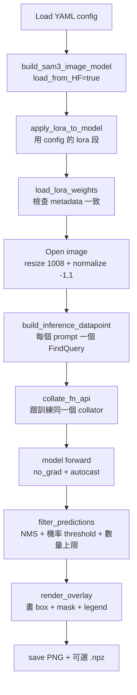

# 06 — 推論 + 評估 + 實操:從零跑通 SAM3+LoRA

> 系列第 6 份(最後一份)。前置:[05 訓練流程 + Slurm](05_training_loop_and_slurm.md)。

---

## 為什麼這份是壓軸

前 5 份是「**懂**」,這份是「**做**」。讀完你應該能:
- 拿一張影像跑出 mask + box 視覺化
- 拿模型在驗證集算 mAP
- 從零完整 reproduce 一次 stage 1 訓練(本機 smoke → HPC 完整訓練)
- 接上 stage 2(CBD pipeline)拿來生成 anatomical priors

---

## 三種推論模式

| 腳本 | 用途 | 輸入 | 輸出 |
|---|---|---|---|
| `infer/infer_lora.py` | **單張影像推論** | 一張 PNG/JPG + 文字 prompt | overlay PNG + 可選 .npz |
| `infer/infer_video_lora.py` | **影片追蹤** | MP4 / frame 序列 + 文字 prompt | 追蹤軌跡 + overlay video |
| `infer/infer_cbd_clip.py` | **CBD clip(stage 2 整合)** | 5 秒 clip(25 frames)+ stage1 LoRA + stage2 model | bbox JSON + overlay |

→ Stage 1 學的 LoRA 通常透過 `infer_video_lora.py` 用,因為下游需要的是「連續 25 frames 的 mask」。但偵錯時用 `infer_lora.py` 單張看比較快。

---

## 模式 1:單張影像推論(`infer_lora.py`)

### 命令範本

```bash
python infer/infer_lora.py \
    --config /path/to/run_dir/icglceaes_lora.yaml \
    --weights /path/to/run_dir/best_lora_weights.pt \
    --image /path/to/test_frame.png \
    --prompt gallbladder --prompt liver \
    --output /path/to/output_overlay.png \
    --threshold 0.5 \
    --nms-iou 0.5 \
    --max-detections 100 \
    --device cuda \
    --save-predictions
```

### 命令逐項說明

| 旗標 | 意義 | 預設 |
|---|---|---|
| `--config` | 訓練時用的 YAML(必須跟 `--weights` 對應同一次訓練) | 必填 |
| `--weights` | LoRA 權重檔路徑 | `{output_dir}/best_lora_weights.pt` |
| `--image` | 輸入影像 | 必填 |
| `--prompt` | 可重複多次,每次一個或多個 prompt | 必填 |
| `--output` | 輸出 overlay PNG 路徑 | 必填 |
| `--resolution` | SAM3 輸入正方形邊長 | 1008 |
| `--threshold` | 機率閾值,低於不算 detection | config 的 `prob_threshold`(0.5) |
| `--nms-iou` | NMS IoU 閾值,移除重疊 detection | config 的 `nms_iou`(0.5) |
| `--max-detections` | 每 prompt 保留的最多 detection 數 | config 的 `max_detections`(100) |
| `--save-predictions` | 把原始預測存成 `.npz`(同名) | 預設不存 |
| `--show-masks` / `--hide-masks` | 控制是否在 overlay 畫 mask(box 永遠畫) | 預設畫 |

### 內部流程(`run_inference()` @ `infer/infer_lora.py:307-405`)



### 輸出範例

```
Saved overlay to output_overlay.png
  gallbladder: 1 detections
  liver: 1 detections
  total: 2
```

PNG overlay 上會有:
- 不同顏色的 bbox(每個 prompt 一個顏色)
- 半透明 mask(若 `--show-masks`)
- 圖左下角 legend(prompt → 顏色對應)

---

## 模式 2:影片追蹤(`infer_video_lora.py`)

### 用途

Stage 1 真正餵給 stage 2 的東西。把 LoRA fine-tuned SAM3 套上 SAM3 的 video tracker,在連續 frames 上產生**時間連續一致**的 mask。

### 三種 prompt 策略

| 策略 | 行為 | 何時用 |
|---|---|---|
| `first` | 只在第 0 frame 給 prompt,後續純 tracker propagation | 短 clip、物體大致不動 |
| `stride` | 每隔 N frames 重新 prompt 一次 | 長 video、漸進變化 |
| `adaptive` | **依 health threshold 自動判斷何時 re-prompt** | 預設,平衡品質與成本 |

→ `bsafe_cbd.yaml:36-40` 用的是 `strategy: adaptive`、`stride: 8`、`adaptive_health_threshold: 0.5`。

### 命令範本(典型)

```bash
python infer/infer_video_lora.py \
    --config /path/to/run/icglceaes_lora.yaml \
    --weights /path/to/run/best_lora_weights.pt \
    --video /path/to/clip.mp4 \
    --prompt gallbladder --prompt liver \
    --strategy adaptive \
    --stride 8 \
    --output /path/to/output_dir/
```

具體可用旗標見 `infer/infer_video_lora.py` 的 argparser(本份不展開)。

---

## 模式 3:CBD Clip 推論(`infer_cbd_clip.py`)

### 用途

**整合 stage 1 與 stage 2**:把一個 5 秒 clip(25 frames)餵進「stage 1 LoRA(產 anatomical mask)+ stage 2 ConvNeXt+Transformer(吃 RGB+mask 預測 CBD bbox 與 fluorescence quality)」的完整 pipeline。

### 輸入

- 5 秒 clip(由 `data_utils/prepare_cbd_clips.py` 從原始 video 切出)
- Stage 1 LoRA(`runs/ibsafe_lora/.../best_lora_weights.pt`)
- Stage 2 model checkpoint(由 `train/train_cbd.py` 產出)
- `bsafe_cbd.yaml`(整合兩個 stage 的設定)

### 輸出

- `*_overlay.json`(每筆預測:bbox xywh、IoU、預測類別 soft/hard)
- `*_overlay.png`(視覺化)
- 可選 heatmap

→ 這個腳本是 stage 1+2 完整管線的測試入口。本系列只到 stage 1,深入用法留到後續筆記。

---

## Metrics 計算

### `compute_cbd_prediction_metrics.py`

`cbd_v1/compute_cbd_prediction_metrics.py`,放在 repo 根目錄。

**輸入**:某個資料夾,內含一堆 `*_overlay.json`(由 `infer_cbd_clip.py` 產出)
**輸出**:單一 JSON,包含 detection metrics + classification metrics

### Detection metrics(`L128-151`)

| Metric | 意義 |
|---|---|
| `num_samples` | 樣本數 |
| `mean_iou` | 預測 box 跟 GT box 的平均 IoU |
| `mAP` | 平均 AP across IoU 0.50-0.95(每 0.05 一階)|
| `mAP50` | IoU=0.50 下的 AP(粗略 detection 品質)|
| `recall` | IoU≥0.50 的召回比例 |
| `mean_recall_50_95` | 跨 IoU 階的平均 recall |

### Classification metrics(`L167-232`)

預測 CBD fluorescence 是 **soft / hard**(對應 well-visualized / poorly-visualized):
- `accuracy`、`macro_precision`、`macro_recall`、`macro_f1`
- `per_class`(每類的 precision/recall/F1/support)
- `confusion_matrix`

→ 這些是 stage 2 產出的指標,**stage 1 本身的 box detection 品質**通常用 `eval_lora.py` 算(在驗證集上跑 SAM3+LoRA → 算 mAP)。

### `eval_lora.py`(stage 1 自己的評估腳本)

`infer/eval_lora.py`,跟 `infer_lora.py` 類似但會跑整個 val/test split 並輸出 COCO 格式 metrics:

```bash
python infer/eval_lora.py \
    --config /path/to/run/icglceaes_lora.yaml \
    --weights /path/to/run/best_lora_weights.pt \
    --split test \
    --output /path/to/eval_results.json
```

→ 拿 mAP / mAP50 / per-class AP 評估 stage 1 訓得好不好。

---

## ⭐ 從零跑通 stage 1 訓練的完整實操腳本

這是本系列最重要的一段。以下分四階段,**每一步都標明在本機還是 HPC 上跑**。

### 階段 0:環境準備(只做一次)

#### 0.1 在 HPC 上設好 Conda env

```bash
# SSH 進 HPC 後
ssh forge.icube.unistra.fr   # 或你拿到的具體跳板
ls /home2020/home/miv/vedrenne/mambaforge/  # 工程師的 mamba 安裝
```

通常**你會用工程師建好的 `py311cu118` env**(參考 `slurm/schedule_train.py:42-43`)。如果要自己建:
```bash
mamba create -n my_lora python=3.11
mamba activate my_lora
pip install torch==2.x.x torchvision  # 對應 cuda 11.8
pip install -r requirements.txt        # 若有
```

#### 0.2 確認 Hugging Face checkpoint 可下載

```bash
python -c "from huggingface_hub import hf_hub_download; \
           print(hf_hub_download(repo_id='facebook/sam3', filename='sam3.pt'))"
```

→ 第一次會下載 ~5 GB(放到 `~/.cache/huggingface/`),之後會 cache。
→ HPC 若無法外網,可先在本機下載再 scp 過去,然後在 config 寫 `model.checkpoint_path: /path/to/sam3.pt; load_from_hf: false`。

### 階段 1:本機 smoke test(確認程式碼能 launch)

#### 1.1 準備 mini dataset

跟工程師要一份 mini subset(例如 train 5 張 + val 2 張的 ICG 影像 + 對應 COCO JSON)。放在本機:
```
~/local_camma_data/
└── ICG-LC-EAES/
    ├── train/
    │   ├── images/{5 張 PNG}
    │   └── annotation_coco.json
    └── val/
        ├── images/{2 張 PNG}
        └── annotation_coco.json
```

#### 1.2 修改 smoke config 指向本機資料

複製 `configs/endoscapes_lora_smoke.yaml` 為 `configs/icg_smoke_local.yaml`,改:
```yaml
data:
  dataset_root: /home/{your_user}/local_camma_data/
  dataset_name: ICG-LC-EAES
  bbox_anchor: center
  class_names: [gallbladder, liver]
training:
  use_mask_loss: false
lora:
  apply_to_mask_decoder: false
  rank: 4   # smoke 用更小
  alpha: 8
  apply_to_vision_encoder: false  # smoke 不訓 vision(省時間)
  apply_to_text_encoder: true
hardware:
  device: cpu
output:
  output_dir: ./smoke_outputs
```

#### 1.3 啟動 smoke test

```bash
cd /mnt/d/Camma_project/BSAFE_code_luc/cbd_v1
python train/train_lora.py --config configs/icg_smoke_local.yaml
```

**預期 log**(成功的話):
```
Building SAM3 model...
Applying LoRA...
Replaced X nn.MultiheadAttention modules with MultiheadAttentionLoRA
Applied LoRA to N modules
Trainable params: ~50,000 (0.005%)
Loading training data from /home/.../ICG-LC-EAES...
Training for 1 epochs (5 optimizer steps)
Epoch 1/1: 100%|██| 5/5 [01:23<00:00, loss=8.5, lr=0.00e+00]
Epoch 1: train_loss=8.4, val_loss=8.2
Finished training after 5 optimizer steps
Best validation loss: 8.2000
```

→ 看到 `Finished training` = 程式碼路徑通了。**smoke 不在乎 loss 數值是否合理**,只要不 crash 就行。

#### 1.4 跑單張推論驗證

```bash
python infer/infer_lora.py \
    --config configs/icg_smoke_local.yaml \
    --weights smoke_outputs/best_lora_weights.pt \
    --image /home/.../ICG-LC-EAES/val/images/some_frame.png \
    --prompt gallbladder --prompt liver \
    --output ./smoke_overlay.png \
    --threshold 0.1 \
    --device cpu
```

→ 打開 `smoke_overlay.png`,有 bbox(可能很爛,因為只訓 5 張)。**重點是流程能跑完**。

### 階段 2:HPC 上完整訓練

#### 2.1 SSH 進 HPC、進 repo

```bash
# 假設 repo clone 在 HPC 上的 /home2020/.../my_clone/cbd_v1
cd /home2020/.../my_clone/cbd_v1
```

#### 2.2 確認 config 路徑指向真實資料

打開 `configs/icglceaes_lora.yaml`,確認:
```yaml
data:
  dataset_root: /home2020/home/miv/vedrenne/data/camma  # ← HPC 上的真實路徑
  dataset_name: ICG-LC-EAES
  ...
```

→ 若你不能讀工程師的目錄,需要 sym-link 或請他開權限。

#### 2.3 提交訓練 job

```bash
python slurm/schedule_train.py \
    --config configs/icglceaes_lora.yaml \
    --experiment my_first_lora \
    --num-runs 1
```

預期輸出:
```
:: Scheduling runs with SLURM
Submitted batch job 12345678
```

→ 同時 `runs/my_first_lora/{timestamp}/run_1/` 會被建立。

#### 2.4 監控進度

```bash
# 看自己的所有 job
squeue -u $USER

# 看具體 job 狀態
scontrol show job 12345678

# 即時看訓練 log
tail -f runs/my_first_lora/{timestamp}/run_1/train_run_1.out
```

訓練中若想停:
```bash
scancel 12345678
```

#### 2.5 訓練完成後檢查產物

```bash
ls runs/my_first_lora/{timestamp}/run_1/
# 預期:
#   icglceaes_lora.yaml
#   train_run_1.job
#   train_run_1.out
#   best_lora_weights.pt    ← 用這個
#   last_lora_weights.pt
#   val_stats.jsonl         ← train/val curve 資料
#   checkpoint-100/
#   checkpoint-200/
#   ...
```

#### 2.6 視覺化 train/val curve

```python
# 在 HPC 或下載 val_stats.jsonl 到本機
import pandas as pd
import matplotlib.pyplot as plt
df = pd.read_json("runs/my_first_lora/{timestamp}/run_1/val_stats.jsonl", lines=True)
df.plot(x="global_step", y=["train_loss", "val_loss"])
plt.show()
```

→ 如果看到 train_loss 一直下降但 val_loss 反彈 → 過擬合(可降 epochs、加 dropout、檢查資料 leakage)。

### 階段 3:評估與整合

#### 3.1 在 val/test split 算 mAP

```bash
python infer/eval_lora.py \
    --config runs/my_first_lora/{timestamp}/run_1/icglceaes_lora.yaml \
    --weights runs/my_first_lora/{timestamp}/run_1/best_lora_weights.pt \
    --split test \
    --output runs/my_first_lora/{timestamp}/run_1/eval_test.json
```

→ 看 `eval_test.json` 裡的 `mAP50` 跟 `per_class_AP`。對 ICG 這種小 dataset,**mAP50 達到 0.5-0.7** 算合理起步。

#### 3.2 接上 stage 2 pipeline

複製 `bsafe_cbd.yaml`,改 `stage1_sam3.config_path` 與 `weights_path` 指向你的 run:
```yaml
stage1_sam3:
  config_path: /home2020/.../runs/my_first_lora/{timestamp}/run_1/icglceaes_lora.yaml
  weights_path: /home2020/.../runs/my_first_lora/{timestamp}/run_1/best_lora_weights.pt
  easy_prompts: [gallbladder, liver]
  strategy: adaptive
  ...
```

→ stage 2 訓練 / 推論的細節留給後續系列筆記。

### 階段 4:迭代優化

如果 stage 1 mAP 不夠好,可以試:

| 假設原因 | 做法 |
|---|---|
| 資料量太少 | 跟工程師要更多 ICG 標註 |
| LoRA 容量不夠 | `rank: 16 → 32`(注意 weights 不能跨 rank 載入,要重訓)|
| 視覺特徵沒適應 | `apply_to_vision_encoder: true`(已是 default)|
| 訓練不夠久 | `num_epochs: 15 → 30` |
| 過擬合 | `dropout: 0.1 → 0.2`、減 epochs |
| Learning rate 沒調對 | `5e-5 → 2e-5` 或 `1e-4` 試兩端 |
| augment 太弱 | 加更多(但不要破壞語意,例如不要垂直翻)|

→ 每次只改一個變數,跑完比較 `val_stats.jsonl` 的最佳 val_loss + `eval_test.json` 的 mAP50。

---

## 「在 codebase 哪裡」速查表

| 議題 | 檔案 | 行號 |
|---|---|---|
| 單張推論主入口 | `infer/infer_lora.py` | 445-456 |
| `run_inference()`(完整流程)| `infer/infer_lora.py` | 307-405 |
| `build_lora_config()` 從 YAML 構建 | `infer/infer_lora.py` | 47-61 |
| 影像前處理 | `infer/infer_lora.py` | 87-91 |
| `filter_predictions`(NMS + threshold)| `infer/infer_lora.py` | 約 230-280(內部函式) |
| `build_inference_datapoint` | `infer/infer_lora.py` | 內部 |
| `render_overlay` | `infer/infer_lora.py` | 內部 |
| Argparse 完整旗標 | `infer/infer_lora.py` | 408-442 |
| 影片追蹤入口 | `infer/infer_video_lora.py` | 全檔 |
| CBD clip 整合推論 | `infer/infer_cbd_clip.py` | 全檔 |
| Eval(全 split mAP)| `infer/eval_lora.py` | 全檔 |
| Metrics 計算 | `compute_cbd_prediction_metrics.py` | 128-232 |
| Smoke config | `configs/endoscapes_lora_smoke.yaml` | 全檔 |
| stage 1 引用設定(stage 2 接口)| `configs/bsafe_cbd.yaml` | 29-42 |

---

## 常見疑問

### Q1:推論時 GPU 必要嗎?

A:**強烈建議 GPU**。CPU 上推論一張影像可能要 30 秒+,GPU 上 < 1 秒。本機沒 GPU 想 demo 的話用 smoke config (`device: cpu`)勉強可跑(慢但能完成)。

### Q2:`--prompt gallbladder --prompt liver` 跟 `--prompt gallbladder liver` 哪個對?

A:看 argparser 設定(`infer_lora.py:415-421`)。`action="append", nargs="+"` 表示**兩種寫法都接受**:
- `--prompt gallbladder --prompt liver` → 兩次 append,每次一個字串
- `--prompt gallbladder liver` → 一次 append,nargs 收兩個字串
- 兩者最後都被 `flatten_prompts()` 攤平成 `["gallbladder", "liver"]`

### Q3:視覺化結果裡看到很多重疊 bbox 怎麼辦?

A:三個調整方向——
- 降低 `--max-detections`(預設 100 太多)
- 提高 `--threshold`(0.5 → 0.7)
- 調 `--nms-iou`(0.5 → 0.3 更激進地移除重疊)

### Q4:推論時報 `LoRA checkpoint config does not match`?

A:`load_lora_weights()` 嚴格檢查 config 一致(03 提到的)。原因通常:
- `--config` 不是訓練時的同一份 YAML(用了不同 rank/alpha/apply_to_*)→ **指向 run 目錄裡的 config 副本**(`runs/.../run_1/icglceaes_lora.yaml`)
- 訓練時手動改了 config 但忘了重訓 → 重訓
- 跨機器訓練 / 推論用了不同版本 config → 用 run 目錄裡那份

### Q5:推論結果完全空(`total: 0`)?

A:幾個診斷——
1. **prompt 拼錯**:必須跟訓練時的 class_names 一致(case 也要對,通常 `gallbladder` 全小寫)
2. **threshold 太高**:暫時降到 0.1 試試
3. **影像不在訓練分布**:用其他更典型的 ICG 影像測試
4. **權重檔錯**:確認 `--weights` 指向 `best_lora_weights.pt` 不是 `last_lora_weights.pt`(後者可能還沒收斂)

### Q6:整個 pipeline(stage 1 + stage 2)我能在本機跑嗎?

A:推論可以(慢),訓練幾乎不行(VRAM)。**典型工作流**:訓練在 HPC、推論在本機(尤其要視覺化、debug 時)。

### Q7:`best_lora_weights.pt` 我要怎麼從 HPC 拷到本機?

A:`scp`:
```bash
scp username@hpc:/home2020/.../runs/my_first_lora/{ts}/run_1/best_lora_weights.pt \
    /local/path/best_lora_weights.pt
```
或用 rsync(支援續傳大檔):
```bash
rsync -avzP username@hpc:/home2020/.../best_lora_weights.pt /local/path/
```

---

## 本份筆記要帶走的 7 件事

1. ✅ **三種推論模式:單張(infer_lora)/ 影片追蹤(infer_video_lora)/ 整合 stage 2(infer_cbd_clip)**
2. ✅ **單張推論的完整命令模板**(配 prompt + threshold + nms-iou)
3. ✅ **`load_lora_weights` 嚴格檢查 config 一致性**——用 run 目錄裡的 config 副本最安全
4. ✅ **「從零跑通」四階段:0 環境 / 1 本機 smoke / 2 HPC 完整訓練 / 3 評估與整合**
5. ✅ **訓練後的產物在 `runs/{experiment}/{timestamp}/run_1/`**,核心是 `best_lora_weights.pt` + `val_stats.jsonl`
6. ✅ **過擬合的徵兆**:val_loss 反彈 → 降 epochs / 加 dropout / 檢查資料
7. ✅ **stage 1 → stage 2 接口**透過 `bsafe_cbd.yaml` 的 `stage1_sam3` 段落,引用訓出的 LoRA

---

## 系列總結:你現在能做什麼?

讀完 6 份筆記,你應該能:

✅ 讀懂工程師交付的 stage 1 程式碼(`train/train_lora.py` + `src/sam3/lora/` + `configs/icglceaes_lora.yaml`)
✅ 解釋 SAM3 為何適合手術影像、LoRA 為何省 VRAM、為何只訓 box detection
✅ 在本機 smoke test、在 HPC 提交訓練 job、解讀 train/val log
✅ 用 `infer_lora.py` 做單張視覺化、用 `eval_lora.py` 算 mAP、用 `compute_cbd_prediction_metrics.py` 算下游 metrics
✅ 把訓出的 `best_lora_weights.pt` 接給 stage 2 當 anatomical priors 來源

**接下來的學習路徑**:
- Pipeline stage 2 = **ConvNeXt-Small backbone + spatiotemporal transformer**(整合 25 frames RGB + SAM3 mask → 預測 CBD bbox + fluorescence quality)
- 後續筆記會針對:
  - ConvNeXt 的角色與功能(對比 ViT)
  - Spatiotemporal feature fusion 機制
  - 模型 deployment 技術

→ 準備好告訴我下一個你想拆解的部分。

---

## 索引導覽

[01 總覽](01_sam3_lora_overview.md) — Pipeline 第一塊全景 + 工程師原文拆解
[02 SAM3 架構深解](02_sam3_architecture_deep.md) — 五大組件 + forward pass
[03 LoRA 原理與凍結策略](03_lora_principles_and_freeze.md) — 數學 + 實作 + 為何凍結 mask decoder
[04 資料管線](04_data_pipeline_class_prompted_box.md) — COCO → BatchedDatapoint
[05 訓練流程 + Slurm](05_training_loop_and_slurm.md) — Trainer 主迴圈 + Loss + HPC 提交
**[06 推論 + 評估 + 實操](06_inference_eval_handson_recipe.md)** ← 你在這裡
